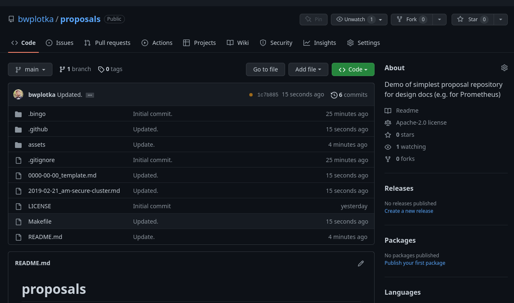

## Unified Proposal Process for Prometheus and Prometheus-community

* **Owners:**
  * [@bwplotka](https://github.com/bwplotka)

* **Implementation Status:**
  * Not implemented: demo done in https://github.com/bwplotka/proposals

* **Other docs or links:**
  * https://github.com/openshift/enhancements/ (bit too complex, too tedious to fight with Python linter)
  * [KEPs](https://github.com/kubernetes/enhancements)
  * [Thanos Proposal process](https://thanos.io/tip/contributing/proposal-process.md/)

> TL;DR: This design document is proposing a single way of proposing changes to software, processes and anything else regarding [Prometheus](https://github.com/prometheus) and [Prometheus community](https://github.com/prometheus-community) projects. The proposal is to move to https://github.com/prometheus/proposals as the main source and record of officially proposed design docs. Design docs will be snapshot-ed in form of markdown files in GitHub. Discussions related to proposals will be within relevant GitHub PRs, Issues and Discussions. See a demo repository in https://github.com/bwplotka/proposals and demo PR with the new (this) proposal.

## Why

It’s important to clearly explain the reasons behind certain design decisions in order to have a consensus in the community. This is especially important in Prometheus, where every decision might have big impact given high adoption and stability of the software and standards we work on. In our world, no decision is perfect, so having a design document that explains the trade-off's we made is essential, so it can also be used later on as a reference and knowledge-sharing purposes.

It is important to have a single way of proposing those bigger ideas and have a single place of reviewing, discovering them, working on them and generally having a record of past decisions and approvals.

### Pitfalls of the current solution

Currently, we have no strict process of proposing bigger ideas in form of design docs. We try to maintain index of Google Docs in https://prometheus.io/docs/introduction/design-doc/, but it has some flaws:

1. We are missing a consistent design doc template that will enable authors to focus on content and get readers more consistent experience (less friction!)
2. Google Docs are owned by authors, so even after acceptance they can change without approvals or even notifications (Google Docs are versioned, but it's not grouped very well, so it's hard to track changes). They can also get deleted e.g. check "Persist Retroactive Rules" design doc on https://prometheus.io/docs/introduction/design-doc/.
3. There is no process related to discovery, review and approval of design docs (or updating the index). This results in unknowns and simply less motivation for community to bring ideas to the table. It also makes it hard to find consensus given many discussion channels. Approvals should be also signed, verifiable and transparent.
4. Google Docs are not searchable/discoverable easily. Updating index manually takes effort and it's easy to miss.

## Goals

* Allow easy and fruitful collaboration on ideas.
* Allow verifiable and transparent decision making on design ideas.
* Clearly version and track changes of accepted / rejected proposals.
* Have a consistent design style that is readable and understandable.
* Move [the previous design docs](https://prometheus.io/docs/introduction/design-doc/) to new place/process.

## Non-Goals

* Strict tracking of the exact implementation status: I don't think this will ever work as a feature of design doc hosting, as dedicated solutions like listing PRs and Issues with/or labels should be better used for those things.

## How

I proposed a dedicated repository `github.com/prometheus/proposals` that will contain proposals in the Markdown format ([GFM](https://github.github.com/gfm/)), formatting/link checking tooling and instructions on how to collaborate on ideas (see [Alternatives 1 and 2](#alternatives) for rationales and alternatives considered around placement).

Markdown files might feel like more overhead than Google Docs, but based on the research and feedback from people it feels like a good trade off. It's a good balance between writing effort versus readability, review and decision clarity (see [Alternatives 3](#alternatives)).

Given initial feedback, I would propose to not render proposals on Prometheus website because it can cause confusion of proposed features being in stable codebase and treating those design documents as feature documentation.

One good argument against repositories like this or websites with design docs is the beauty of stable URL of the Google Document, so it can be referenced and valid longer. I propose treating the GitHub repo name and file name in very stable way and (ideally) never change it after acceptance. This will result in similar, stable characteristics and ability to get `latest` version of same proposal or even referencing permanent link to exact version of the design document.

### Details

I propose to host in git only accepted proposals, simply in the root directory. It will roughly look like this:

Given that, the process of proposing change with the design doc would look as follows (we can use below text as the initial instruction):

1. Fork `github.com/prometheus/proposals`
2. Create a GitHub Pull Request with a design document in markdown format to root directory of the repository. Make sure to use [template](0000-00-00_template.md) the guide for what sections should be present in the document. Put creation date (the day you started preparing this design doc) as the prefix and some unique name as the suffix in the file name.
   1. If you prefer Google Docs on any other collaboration tool, feel free to use it in the initial state. we recommend [Open Source Design Doc Template](https://docs.google.com/document/d/1zeElxolajNyGUB8J6aDXwxngHynh4iOuEzy3ylLc72U/edit#). However, the approval process will only happen officially in the Pull Request.
3. Automatic formatter is enabled in the repository. Use `make` locally to format it. Use `make check` to check all link (will be done on the CI too).
4. The design is accepted if the PR is merged to this repository. It's totally ok to decide eventually to reject the proposal and simply close the PR with meaningful reasons of why it was rejected.
   1. If more eyes are needed or no consensus was made: Propose and announce your idea on
      [Prometheus DevSummit](https://docs.google.com/document/d/11LC3wJcVk00l8w5P3oLQ-m3Y37iom6INAMEu2ZAGIIE/edit)
      or mailing list to gather more information. You are welcome to start working on design doc before bigger discussion--it is often easier
      to start discussion with prior information prepared. Be prepared that the idea might be rejected later--still the record of the document in the Pull Request is useful even in rejected state to inform about past decisions and opportunities considered.
   2. Optionally: Find sponsor among Prometheus maintainers to get momentum on a change.

Once PR get merged, the design doc can change, but it requires (less strict, but still) a PR with review and merge by a maintainer.

There are two features that are present in current index page: Implementation Status and TODO design docs.

### TODO Proposals

For `TODO`s, so ideas for design docs we know we want (e.g. it was decided on the DevSummit). I propose to use GitHub Issues in `github.com/prometheus/proposals` repository for those with appropriate `TODO` label.

### Implementation Status

For Implementation Status I propose "best effort" `Implementation Status` field in markdown and roughly maintained list of links to relevant PRs and Issues. We can iterate over it, but without automation I don't expect owners to always update this field with new changes, so I would keep it best effort for now.

## Alternatives

1. Different placement of design docs in markdown: `prometheus/prometheus`.

We could place them in [Prometheus repo](https://github.com/prometheus/prometheus), which would bring more visibility. There would be some issues though:

* CI checks would get run on every design doc change which will bring a lot of pain. We could invest in special CI rules to avoid this, but it's not trivial.
* Design docs buried somewhere in Prometheus repo will be less discoverable. It also make it harder to categorize GitHub Discussions and Issue related for design docs.
* Design docs does not only relate to Prometheus repo, but full ecosystem or even neighbour projects like Alertmanager and clients. Ideally we can share the same design process across all the things Prometheus Team and community help with.

2. Different placement of design docs in markdown: `prometheus/docs`

We could place them in [Prometheus docs](https://github.com/prometheus/docs) which already hosts [index of design docs](https://github.com/prometheus/docs/blob/main/content/docs/introduction/design-doc.md). There are some issues too:

* Still, there are some CI checks for website which would unrelated.
* Design docs buried somewhere in website implementation and content, despite not rendering the proposals on website. Less discoverable and itt also make it harder to categorize GitHub Discussions and Issue related for design docs.

3. Stick to Google Doc for design docs.

It's worth to explore the idea of sticking to Google Docs as we do right now and try to mitigate the flaws mentioned in [Pitfalls of the current solution](#pitfalls-of-the-current-solution) in some way.

* We could ask to use consistent template.
* We could maintain Prometheus Google Drive and ask owners to transfer ownership to us which would give some immutability. Still tracking consensus and maintaining this is non trivial. Discovery is also poor and would mean extra work to maintain the index page like https://prometheus.io/docs/introduction/design-doc/

4. Have `Accepted`, `Rejected`, `Implemented` directories for different statuses

I feel this is double maintenance effort. Using GitHub PR Close or Merge actions already indicates approval or rejection, so why not using that?

The implementation status proved to be stale very quickly. Manual interactions to update it is not viable as we see from the current index page.

5. Move some metadata to front matter.

We could put title, author, PRs, data and implementation status as YAML in [front matter](https://frontmatter.codes/docs/markdown#front-matter-highlighting) in markdown. This is useful if we would like to build further automation.

Given YAGNI, I think it's not needed at this point, the normal markdown list is good enough, and can be automated/changed in later iterations of proposal repo.

## Action Plan

The tasks to do in order to migrate to the new idea:

* [ ] Copy https://github.com/bwplotka/proposals to github.com/prometheus/proposals
* [ ] Copy instructions from here to README.md
* [ ] Migrate all accepted and docs from https://prometheus.io/docs/introduction/design-doc/ (mainly from Google Docs). Update status on the way (things are not up-to-date).
* [ ] Migrate TODO ideas to GH issues.
* [ ] Decide what to do with in progress unapproved proposals. Potentially move to PRs (or ask owners to do so?)
* [ ] Announce changes
