## Extended range selectors semantics

* **Owners:**
  * @roidelapluie

* **Implementation Status:** Not implemented

* **Related Issues and PRs:**
  * https://github.com/prometheus/prometheus/issues/8429
  * https://github.com/prometheus/prometheus/issues/3806
  * https://github.com/prometheus/prometheus/issues/12967
  * [**Proof of Concept**](https://github.com/prometheus/prometheus/pull/16457)

* **Other docs or links:**
  * [Improving rate and friends](https://docs.google.com/document/d/18ZQ8uOt0yTp8csVf-tl8G-RdgA8n2GqvlZyEvAytPKA/edit?usp=sharing)
  * [Prometheus x-rate](https://docs.google.com/document/d/1y2Mp041_2v0blnKnZk7keCnJZICeK2YWUQuXH_m4DVc/edit?usp=sharing)
  * [Prometheus y-rate](https://docs.google.com/document/d/1CF5jhyxSD437c2aU2wHcvg88i8CjSPO3kMHsEaDRe2w/edit?usp=sharing)
  * [Prometheus a-rate](https://docs.google.com/document/d/1_83XWymIxauup7TidlhSuegqqLF6kLbBuVrvan5CCLo/edit?usp=sharing)
  * [CNCF DRAFT QLSWG Semantics Specification Context](https://docs.google.com/document/d/1A_r7tpLVELIhF1g6xnkmF3RNkX5_XWrSkEU0gKXKIK0/edit?usp=sharing)
  * And many other sources

This document presents several approaches to extend the semantics of range
selectors in PromQL, with the goal of providing more expressive and
representative options *—particularly for functions like `rate`, `increase`, and
similar—* so they better align with diverse user expectations and use cases.

| TL;DR                                                                                                                                                                                |
|--------------------------------------------------------------------------------------------------------------------------------------------------------------------------------------|
| `smoothed` brings better calculation for ranges by utilizing all data prometheus has at its disposal; with the downside that the values after the last scrape will be understimated. |
| `anchored` brings a solution for users looking for integer results.                                                                                                                  |

## Why

Prometheus's current `rate`, `increase`, and similar functions play a foundational
role in PromQL, but their behavior —particularly around range boundaries,
extrapolation, and data irregularities— has long been a source of confusion,
unintended results, and misaligned expectations.

While proposals like xrate, arate, and others have surfaced over the years,
none have achieved wide consensus due to trade-offs in accuracy,
predictability, and user understanding. This proposal aims to rethink how range
selectors operate, offering more expressive and representative modes that
better use the data at disposal.

### Pitfalls of the current solution

Despite its foundational role in PromQL, the current implementation of `rate`,
`increase`, and similar functions suffers from several well-known
limitations that often diverge from user expectations:

- **Incomplete Coverage**: The range selector does not consider samples just outside
  the range, which can cause significant events (e.g. counter spikes) to be
  entirely missed if they fall near the boundaries. It also means that the datapoints used to calculate a rate never cover the full width of the range.
- **Heuristics-Based Extrapolation**: The use of extrapolation heuristics to
  estimate values at range edges introduces non-obvious behavior, especially when
  data points are irregular or missing or when dealing with integer values. This
  can lead to surprising or misleading results, particularly during scrapes with
  jitter or partial data loss, or when integer counter increments are involved.
- **Sub-query Workarounds**: Users have resorted to complex and
  brittle sub-query workarounds (e.g. `[1m:15s]`) to mimic the
  behavior they desire, but these depend heavily on alignment and have to be adjusted to the left-open range selectors introduced in Prometheus v3.
- **Limited Tolerance for Edge Cases**: The current model performs best in idealized,
  “happy-path” scenarios with regular scrapes and clean data. During outages or
  high-jitter conditions, it tends to degrade poorly.

Together, these pitfalls reveal that the current solution lacks the flexibility,
clarity, and robustness needed to serve the full range of modern Prometheus use
cases. The limitations become especially apparent when pushing metrics or when
users coming from other monitoring solutions expect different behaviors.
Enhancing range selector semantics and providing users with explicit,
predictable alternatives is essential to address these shortcomings.

### Datasets

We will work in this design doc mainly with 2 data sets.

The first data set is **complete** and contains the following points:

| Time  | Time delta | Value | Value delta |
|-------|------------|-------|-------------|
| 10s   | -          | 1     | -           |
| 25s   | 15s        | 2     | 1           |
| 40s   | 15s        | 3     | 1           |
| 55s   | 15s        | 4     | 1           |
| 1m10s | 15s        | 5     | 1           |
| 1m25s | 15s        | 9     | 4           |
| 1m40s | 15s        | 10    | 1           |
| 1m55s | 15s        | 11    | 1           |
| 2m10s | 15s        | 12    | 1           |
| 2m25s | 15s        | 13    | 1           |

The second dataset is **partial** and misses 2 of the values (simulating two failed scrapes):

| Time  | Time delta | Value | Value delta |
|-------|------------|-------|-------------|
| 10s   | -          | 1     | -           |
| 25s   | 15s        | 2     | 1           |
| 40s   | 15s        | 3     | 1           |
| 1m25s | **45s**    | 9     | **6**       |
| 1m40s | 15s        | 10    | 1           |
| 1m55s | 15s        | 11    | 1           |
| 2m10s | 15s        | 12    | 1           |
| 2m25s | 15s        | 13    | 1           |

### Prometheus increase computation

Here is how Prometheus computes vectors. In this example, we see a vector at 1m15 and 2m15:

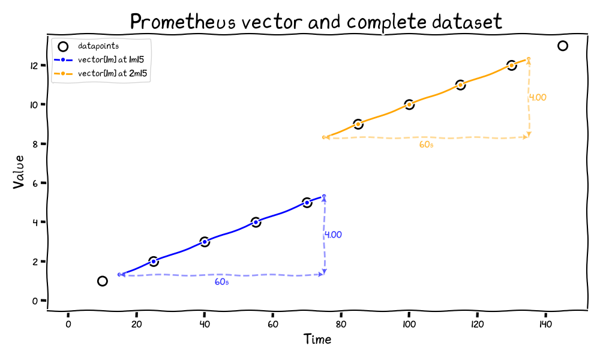

When computing range vectors, Prometheus only considers the data points that
fall strictly within the specified time range. This means that samples that
occur outside are not included in the calculation.

For example, in the diagram above, when calculating a rate over a 1-minute
window ending at 1m15s, Prometheus only uses the data points at 35s and 70s (both
inside the range), while ignoring the huge jump of data at 90s (outside the range).

Two consecutive range selectors therefore fail to capture the increase.

*Note: This limitation, while not a primary concern for Prometheus, demonstrates how a calculation may not accurately represent the complete data range across time intervals.*

It also means that Prometheus can over-estimate a range:

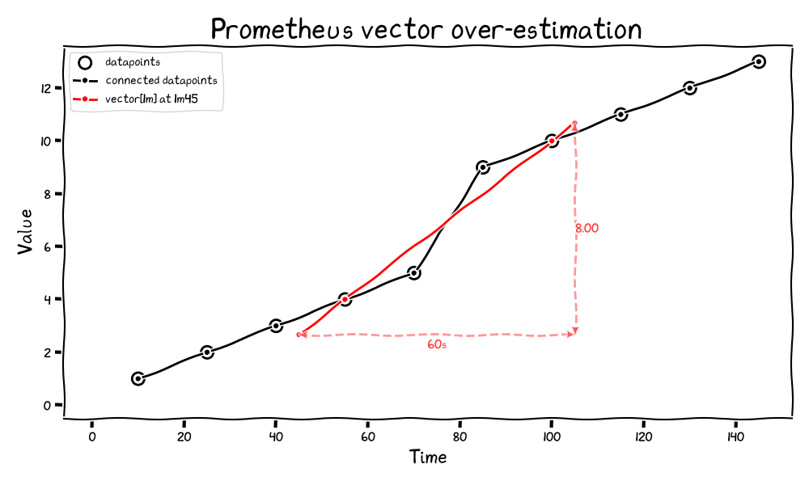

In this graph, the overestimation is 1, which means that Prometheus is artificially *adding* one to the value - one which doesn't actually exist in the collected metrics.

This is the result of calling `increase()` over the range:

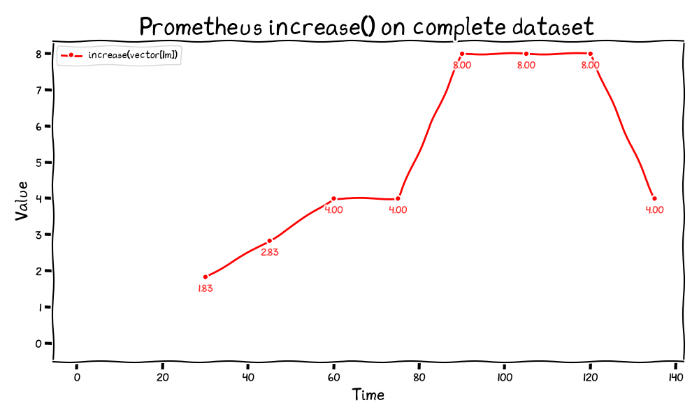

When working with the **partial** dataset, Prometheus is interpolating only by half a scrape interval, which provides this:

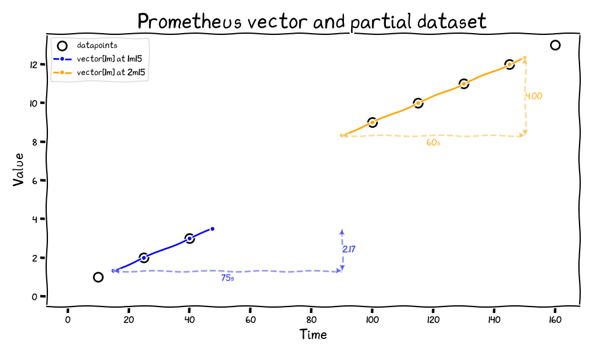

We can clearly see that Prometheus is providing an increase of 2.17 for the first vector, which is an approximation based on the available data points within the range.

When these same interpolation and extrapolation heuristics are applied consistently across the entire partial dataset, we get the following visualization:

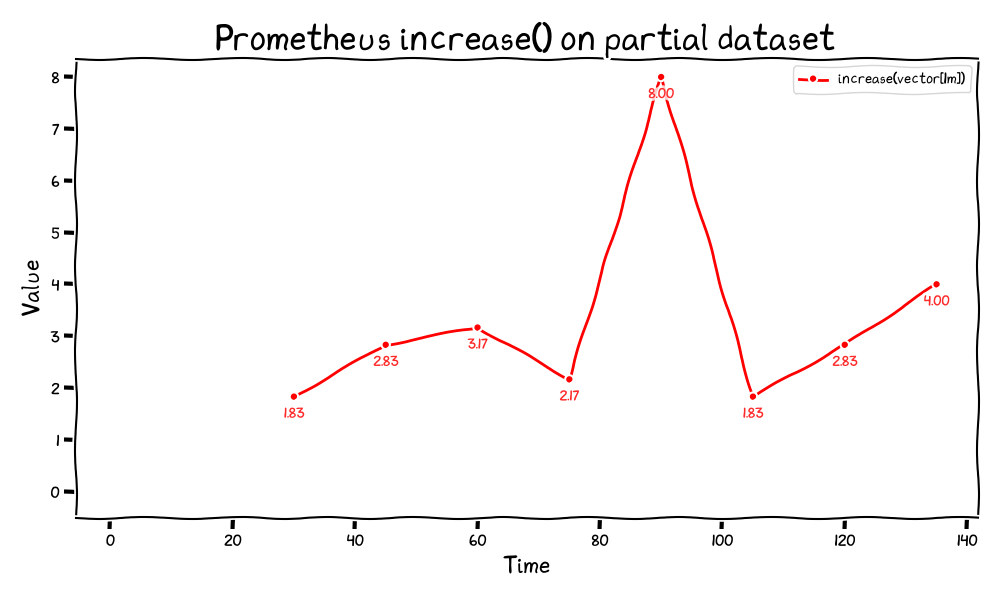

This demonstrates the function's poor behavior in non-ideal scenarios. The graph shows a significant spike that appears and vanishes immediately, highlighting the instability of the calculation when working with incomplete data.

## Goals

The core aim of this proposal is to offer greater composability and flexibility
in how range selectors behave, especially for foundational functions like `rate`
and `increase`. Instead of enforcing a single rigid interpretation of boundary
semantics and extrapolation, the proposal adopts a **"choose what fits best"**
philosophy—recognizing that different use cases benefit from different
trade-offs.

## Non-Goals

While the proposal aims to improve expressiveness and correctness in range-based
functions, it deliberately avoids certain directions that have historically led
to complexity or confusion:

- **Define a one-size-fits-all solution**: The goal is not to find a universally
  "better" rate function that replaces all others. Instead, we aim for a
  balanced approach that addresses two distinct use cases: for improved rate
  calculations that adjust for range length, and direct differences between
  sample values.
- **Create a large set of specialized modifiers**: While flexibility is
  important, we aim to keep the solution focused and manageable. While we add
  these two modifiers, we do not aim to add more modifiers in the future; we'd
  like to build on those two modifiers and adjust them as needed, rather than
  adding more modifiers.
- **Introduce new function names that encode behavior**: Rather than proliferating new
  variants like xrate, yrate, arate, etc., this proposal keeps the function names
  unchanged and introduces boundary behavior via modifiers. This preserves the
  core vocabulary of PromQL and avoids unnecessary fragmentation.
- **Make silent or implicit changes to existing functions**: Backward compatibility
  is critical. The proposal does not seek to silently change the
  semantics of rate, increase, or delta as they exist today. All new behaviors
  must be opt-in and explicit.
- **Abstract away all underlying heuristics**: This is not about hiding complexity—it’s
  about making trade-offs more explicit and controllable. Users still need to
  understand how their choice of modifier affects the results, and documentation
  and naming should reflect that.

## How

### How This Proposal Works

This proposal introduces two new **modifiers for range and instant selectors**
in PromQL: `anchored` and `smoothed`. These modifiers explicitly control how
samples at the **start and end boundaries** of an evaluation window are
handled—whether to include observed values or estimate them when exact samples
are not aligned.

They provide users with precise control over the temporal semantics of PromQL
evaluations, while maintaining compatibility with the existing language and
avoiding implicit heuristics.

#### `anchored`: Include Real Samples at Boundaries

**Examples**:

```promql
increase(http_requests_total[5m] anchored)
```

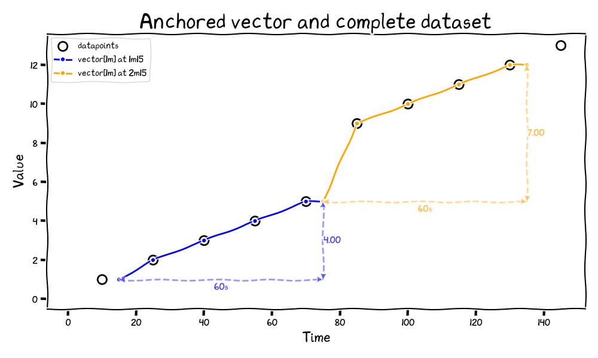

*Anchored vectors ensure boundary completeness by including real samples at range boundaries. The diagram shows how a sample just before the range start (outside the original range) is included, and the last sample at range end is duplicated at the end of the range, making sure there are points to cover the complete interval [start, end].*

**Behavior**:

- This mode includes samples within the range `(start, end]` and additionally looks backward to find one sample at or before the start time.
- Staleness markers are ignored.
- At the start of the range (or evaluation time, for instant selectors),
  Prometheus will search **backward** using a lookback window to find the sample
  just before the boundary.
- If there is no **previous sample**, we duplicate the first sample in the range at the start of the range.
- If no sample is found within the left-open and right-closed selector range, no result is returned for the respective series.
- The lookback window is the lookback delta. Note: The loopback delta can be overriden per-query.

**Use cases**:
- Precise accounting for counter changes (provides integer results with integers)
- Improved composability across range boundaries
- Ensuring observed values are never skipped due to alignment issues

**Anchored increase and complete dataset**

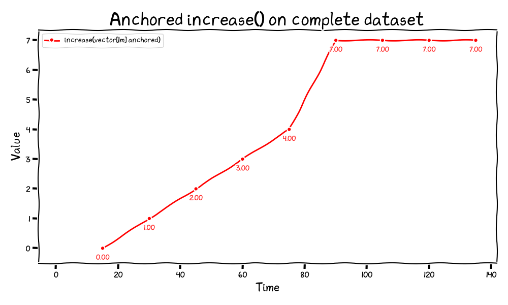

Anchored increase provides integer results at each step. It also fixes the over-interpolation (8) that was shown with Prometheus' increase. By including the actual samples at range boundaries, anchored mode ensures that counter increases are calculated based on real observed values rather than interpolated estimates, resulting in more expected results for counter metrics.

**Anchored vector in partial dataset**

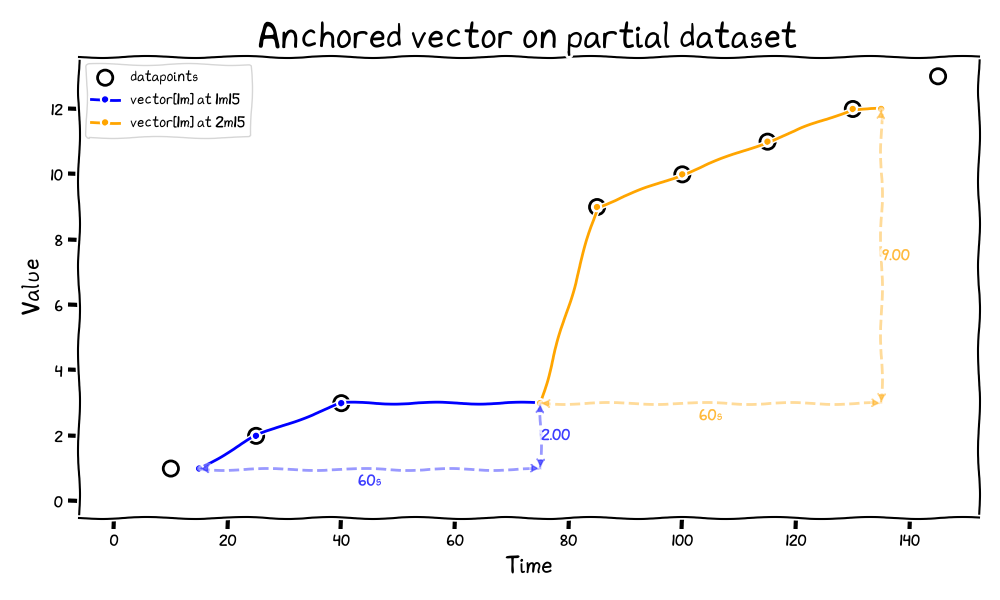

Anchored vectors accurately capture the total increase of 11, though with slight estimation differences between the two time windows. The first window slightly underestimates while the second window slightly overestimates the actual increase.

This behavior effectively implements a "time-to-live" (kind of) for metrics, where values remain "alive" for the duration of the lookback window (5 minutes in this example). For instance, the sample with value 4 recorded at 40s is still used by Prometheus at 75s, even though it was collected 35 seconds earlier, because it falls within the lookback window.

**Anchored increase on partial dataset**

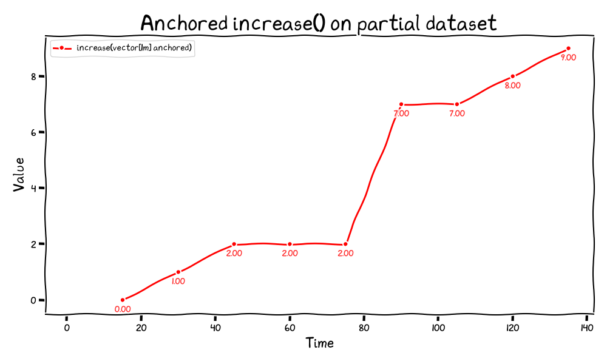

In this diagram, Anchored increase on partial datasets maintains a horizontal line when no new data is available. This behavior occurs because we capture samples up to the beginning of the time series for this exercise (otherwise, the line would slightly decrease). The anchored mode continues to produce integer results throughout.

We also see an increase at the end of the graph, which occurs because the calculation is comparing against the value "3" from much earlier. Since this sample is quite outdated but still falls within the lookback window.

#### `smoothed`: Estimate Boundary Values via Interpolation

**Examples**:

```promql
rate(cpu_usage_total[5m] smoothed)
cpu_usage_total smoothed
```

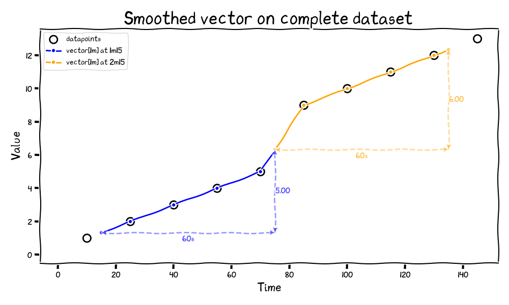

Smoothed vectors behave as if continuous lines were drawn between samples, utilizing linear interpolation to create a smooth transition between data points. This captures the increase of 11.

**Behavior**:
- This mode estimates the values at the range's start and end (or instant
  evaluation time) by **interpolating** between the nearest known samples **before
  and after** each boundary.
- Staleness markers are ignored.
- If there is no datapoint before the range, the first datapoint inside of the range is duplicated at the beginning of the range.
- If there is no datapoint after the range, the last datapoint inside of the range is duplicated at the end of the range.
- If there are no datapoints inside the range but samples exist before and after, it interpolates between those samples to estimate values at the range boundaries.
- The interpolation window is controlled by the **lookback delta**,

**Use cases**:
- Better computation of rates, by taking into consideration before and after the range.

**Smoothed increase on complete dataset**

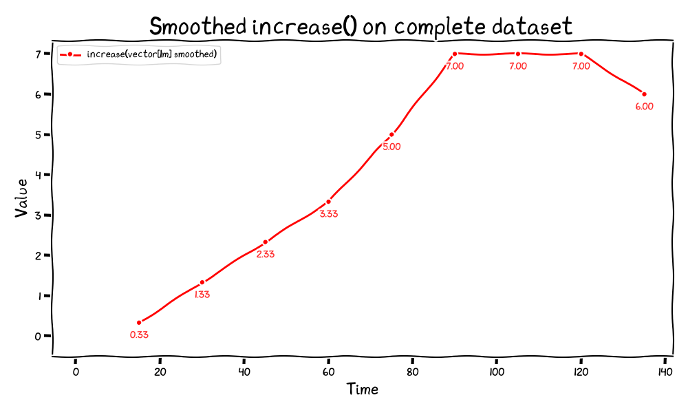

Smoothed increase provides a more accurate estimate by interpolating between data points. At the 15s mark, it calculates a value of 0.33, representing the partial increase that might occur if the data was linear. Unlike the standard increase function, smoothed increase avoids over-extrapolation by using linear interpolation between actual data points.

**Smoothed vector on partial dataset**

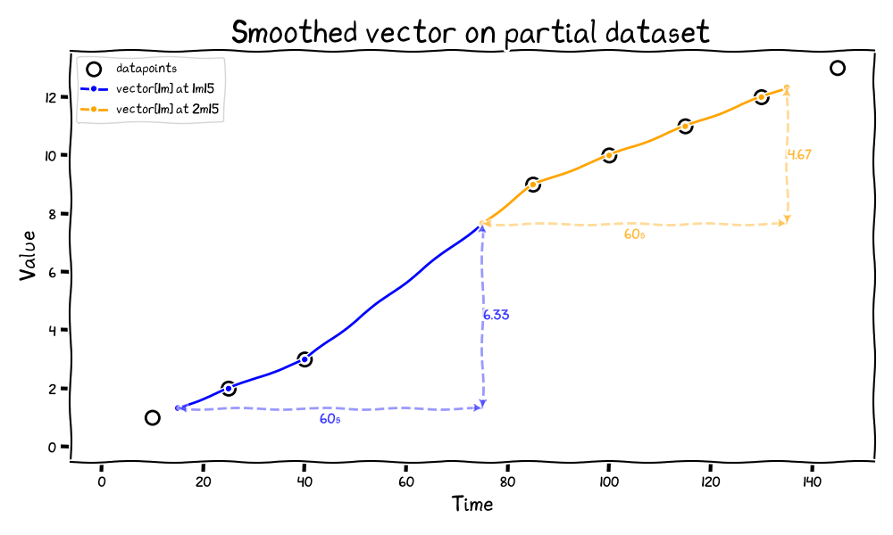

The smoothed approach accurately measures the total increase of 11 by using linear interpolation between available data points. This produces results very similar to what we see with the complete dataset. While we cannot fabricate missing data, the smoothed method leverages all available information in Prometheus to create the most accurate estimation possible through interpolation.

**Smoothed increase on partial dataset**

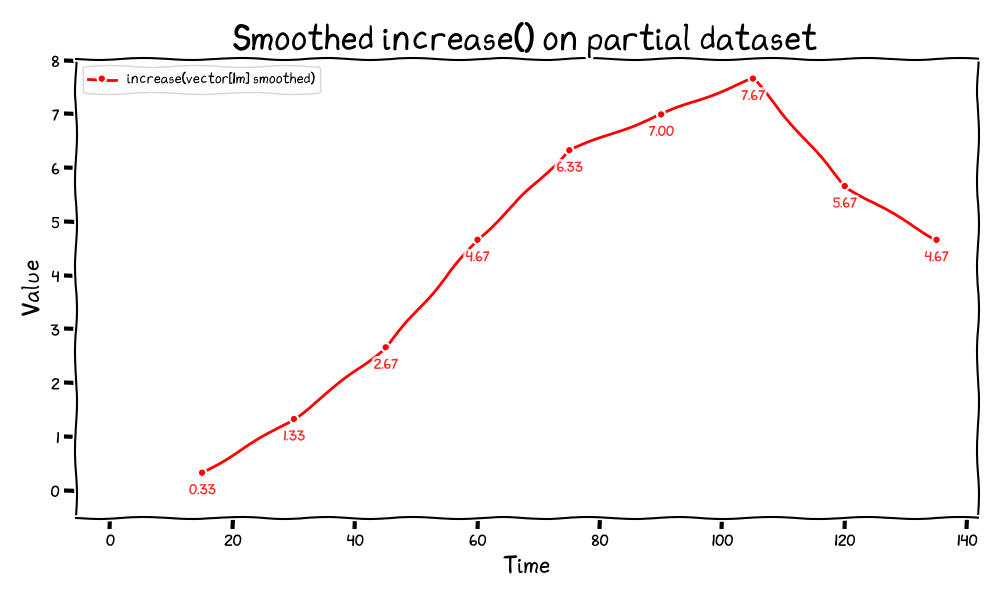

The smoothed increase function effectively bridges gaps in the partial dataset by using linear interpolation between available data points. This approach produces results remarkably similar to those seen with the complete dataset, with only minor variations where interpolation differs from actual values.

### Application to Range and Instant Vector Selectors

The `smoothed` modifiers apply to:
- **Range selectors**: `[10m] smoothed`
- **Instant selectors**: `metric smoothed`

The `smoothed` modifier for instant vector selectors applies linear interpolation at time `t` using the nearest datapoints before and after that time. This creates a continuous estimation of values at range boundaries, resulting in smoother transitions between samples. This is basically smoothing gauges with linear interpolation.

The `anchored` modifiers apply to:
- **Range selectors**: `[10m] anchored`
- **Instant selectors**: `metric anchored`

The `anchored` modifier for instant vector selectors selects a datapoint at `t`, using the lookback delta, and ignoring staleness markers.

### Applications to other functions

Other functions can use `anchored` and `smoothed`:

`changes` + `anchored` can detect a change directly, if the first sample is different than the one before the range.

`resets` + `anchored` can detect a reset directly, if the first sample is different than the one before the range.

`delta` + `smoothed` or `delta` + `anchored` to smooth or anchor gauges.

## Q&A

*Why `smoothed` does not apply extrapolation if there are no points before or after the range?*

Extrapolation for newly appearing counters with new labels or disappearing would
compromise aggregability. Instead, by duplicating the first data point at the
beginning of the range, we maintain accuracy without introducing artificial data calculations.

For queries at the current time ("now"), we also deliberately avoid extrapolation at the end of the range. While this **will always** show a slight drop for metrics with constant rates and "smoothed", this accurately reflects that the data is incomplete at the range boundary. In future iterations, we could introduce a special annotation to indicate this boundary condition if users find it problematic in practice.

These solutions are also meant for metrics that are pushed - in that case, extrapolating would also cause incorrectness.

*What is the impact of Created Timestamp?*

Created Timestamp metadata enhances the precision of the `anchored` modifier by allowing the system to accurately place the initial zero value at the exact moment a counter was created. This ensures we capture the complete increase from the very beginning of a metric's existence. Without Created Timestamp, we might miss the initial increase that occurs between creation and the first sample. With it, `anchored` can duplicate the zero value precisely at the start of the range when appropriate, providing more accurate rate calculations especially for newly created counters.

*Why not take staleness markers into consideration?*

It is important that heuristics remain consistent whether metrics are pulled or pushed. Additionally, staleness markers are not specialized and can indicate various conditions: a disappearing counter, a scrape failure, or a recording rule not returning a result. This ambiguity makes staleness markers unreliable as signals for specific behaviors in rate calculations.

*What about influence from datapoints far outside the query range?*

Yes, datapoints from before the query range can significantly influence the results, especially with short ranges. This can be particularly problematic when using `anchored` if the query range is much smaller than the lookback delta. A **future enhancement** would be to allow specifying custom "lookaround windows" with the modifiers: `anchored (1m)` to limit lookback to 1 minute, or `smoothed (1m:2m)` to define asymmetric windows before and after the range boundaries.

*How to use smoothed as part of recording and alerting rules?*

Since the `smoothed` modifier looks for samples after the evaluation interval, using it in alerting rules would *by default* always under-estimate the result, making it inappropriate for alerting and recording scenarios. When implementing rules with `smoothed`, it's recommended to use `query_offset` to ensure accurate calculations. For critical metrics, the offset should be at least one scrape interval, while less critical use cases may benefit from offsets of multiple scrape intervals to build resilience against missed scrapes.

## Compatibility Notes

When using `*_over_time`, `irate`, `idelta` functions with `anchored` or `smoothed` modifiers, we should introduce warnings in the query results. This is because these modifiers introduce additional datapoints at range boundaries that can affect the calculation semantics. To ensure proper usage, we may initially implement a "whitelist" approach where only specific functions (like `rate`, `increase`, `delta`, `changes`, and `resets`) are explicitly supported with these modifiers, while other functions will generate appropriate warnings until their behavior with these modifiers is fully defined.

## Alternatives

### Alternative 1: Introducing New Functions (xrate, xincrease, etc.)

One alternative would be to introduce new functions with "x" prefix (e.g., `xrate`, `xincrease`) that implement the improved semantics.

**Drawbacks**:
- Proliferation of functions in the language (function explosion)
- Every function that operates on range vectors would need a corresponding "x" version
- Increases cognitive load for users who need to remember which functions use which semantics

### Alternative 2: Modifying Existing Functions

Another approach would be to modify the existing functions like `rate()` to incorporate the improved semantics directly.

**Drawbacks**:
- Breaks backward compatibility for existing queries
- Silent changes in behavior could lead to incorrect interpretations of metrics
- Dashboards and alerts would need to be updated and verified
- Migration path would be complex and error-prone

### Alternative 3: Configuration Flags

Introducing global configuration flags to control range vector semantics.

**Drawbacks**:
- Breaks backward compatibility for existing queries
- Global settings affect all queries, making it difficult to mix approaches
- Configuration becomes environment-dependent, reducing query portability
- Increases operational complexity

### Alternative 4: Implement foo - foo offset 5m with counter reset

Another approach would be to implement counter reset detection using the offset
modifier, such as `foo - foo offset 1h`. This approach attempts to calculate the
difference between the current value and the value from an hour ago. However, this
method has limitations compared to the proposed solution.

With this proposal, `increase(foo[1h] anchored)` provides a more robust alternative and deals with counter resets.
The key difference is that the anchored version will work as long as there is at least
one sample point anywhere within the last hour, whereas the offset approach requires
a sample to exist precisely at the offset time (or within the 5-minute staleness window).
This makes the anchored approach more resilient to irregular scraping intervals and
temporary outages.

## Action Plan

## Implementation Plan

1. Implement the `anchored` and `smoothed` modifier behind the `promql-extended-range-selectors` feature flag for range floats.
2. Implement `smoothed` for instant floats.
3. Implement `anchored` for range histograms and instant histograms.
4. Implement `smoothed` for range histograms and smoothed histograms.

***Implement** means code, benchmark, test and document.*
