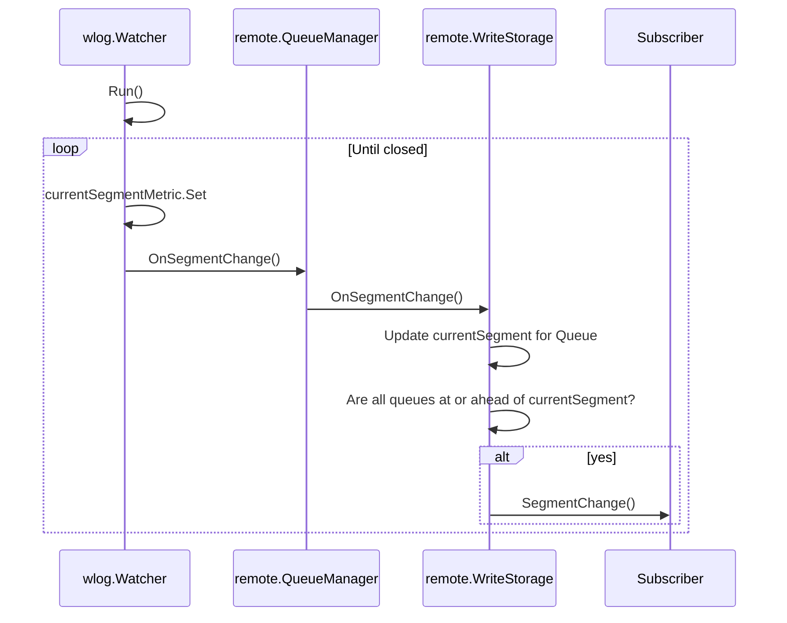
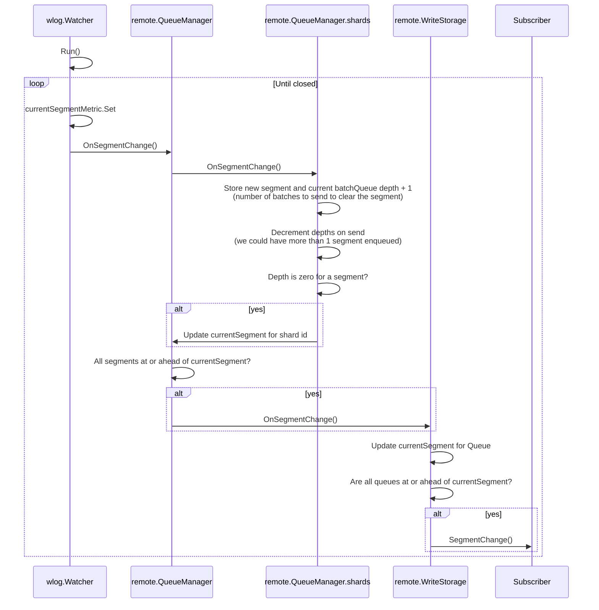

## Remote Write: Restart from checkpoint

* **Owners:**
  * [@kgeckhart](https://github.com/kgeckhart)

* **Implementation Status:** `Not implemented`

* **Related Issues and PRs:**

First issue on the matter https://github.com/prometheus/prometheus/issues/8809 spawned from https://github.com/prometheus/prometheus/pull/7710.

Since then there have been a lot of discussion / attempts but nothing has been merged. See
* https://github.com/prometheus/prometheus/pull/8918
* https://github.com/prometheus/prometheus/pull/9862
* https://github.com/ptodev/prometheus/pull/1

I believe the issue for [tsdb/agent: Prevent unread segments from being truncated](https://github.com/prometheus/prometheus/issues/17616) would need to be completed but can stand on its own as it's purely for notifying when segments have been read.

* **Other docs or links:**

> This effort aims to have an agreed upon design with requirements for completing the work to allow remote write to restart data delivery from a checkpoint and not from `time.Now()`

## Why

Remote write is backed by a write-ahead-log (WAL) where all data is persisted before it is sent.
If a config is reloaded or prometheus/agent is restarted before flushing pending samples we will skip those samples.
Given we have a persistent WAL this behavior is unexpected by users and can cause a lot of confusion.

### Pitfalls of the current solution

As mentioned in the why, this behavior is often confusing to users who know a WAL is in use but still finds they have missing data on restart.

## Goals

1. Support resuming from a checkpoint for each configured `remote_write` destination.
2. Taking a checkpoint for a remote_write destination should not incur significant overhead.
3. Changing the `queue_configuration` for a `remote_write` destination should not result in a new checkpoint entry.
   * The `queue_configuration` includes fields like min/max shards and other performance tuning parameter.s
   * These can be expected to change under normal circumstances and should not trigger a data loss scenario.
4. Guards need to be in place to protect against infinite WAL growth.
5. Stretch: Remote write supports at-least-once delivery of samples in the WAL.
   * Note: This has appeared to be the largest challenge with any existing implementation as it can cause significant overhead.

### Audience

`remote_write` users.

## Non-Goals

* Creating a watcher that is capable of tracking offsets.
* Remote write supports exactly-once delivery

## How

Enabling replay will require changes across `remote.WriteStorage`, `remote.QueueManager`, and `wlog.Watcher`. Implementing https://github.com/prometheus/prometheus/issues/17616 will help as it will provide a hook to signal when segments have been fully read from the watcher through `remote.WriteStorage`. Anytime the `wlog.Watcher` [changes the current segment](https://github.com/prometheus/prometheus/blob/18efd9d629c467877ebe674bbc1edbba8abe54be/tsdb/wlog/watcher.go#L314) the following would happen,

`remote.WriteStorage` would be tracking the currentSegment for each queue supporting. Since this isn't completed it's open to discussion but it seems like a reasonable chunk to start with that has values on its own.

A basic replay to accomplishing all non-stretch goals would be as follows

### Code flow

1. Adding another configurable timer to [`remote.WriteStorage.run()`](https://github.com/prometheus/prometheus/blob/f50ff0a40ad4ef24d9bb8e81a6546c8c994a924a/storage/remote/write.go#L114-L125) periodically persisting the current segments for each queue.
2. Ensure `remote.WriteStorage.Close()` will also attempt to write current segments
3. Read persisted queue segment positions in `remote.NewWriteStorage()`
4. Update `remote.WriteStorage.ApplyConfig` to provide the persisted current segment to `remote.NewQueueManager`
5. Update `remote.NewQueueManager` to provide a starting segment to `wlog.NewWatcher`
6. Update `wlog.NewWatcher.Run()` to start sending samples if a starting segment is configured
7. Walk through the `remote.QueueManager` send code to ensure duplicate data errors will not cause slow downs in data delivery (we have a high probability of sending duplicate data).

This flow should be enough to to accomplish Goal 1: Support resuming from a checkpoint for each configured `remote_write` destination.

The act of taking a checkpoint will require a lock to be held but given we do it on a schedule this will be infrequent enough that the implementation should safely accomplish Goal 2: Taking a checkpoint for a remote_write destination should not incur significant overhead (see testing for further info).

### Checkpoint file format/location

The segment checkpoint would be stored in the `remote.WriteStorage.dir` which would be next to the `/wal` directory.

We only care about the queue hash and the current segment so a json encoded file seems reasonable for this. A key value format should make it easier to evolve over time vs a more basic delimited file.

Solving for, Goal 3: Changing the `queue_configuration` for a `remote_write` destination should not result in a new checkpoint entry.

This will be done via adding a specific toHash function for RemoteWriteConfig which zeros the QueueConfig before taking the hash. RemoteWriteConfig is managed as a pointer so we'll need to keep the value before, set to empty, and put the original value back but all is reasonably managed. We could look at identifying other "operational" fields which could be excluded from hashing for the same reasons.

This will change existing queue hashes but I don't believe that to be a big problem and if it is we can do this hashing specifically for segment tracking only. It is proposed as the first task so we can reduce the amount of use cases which can trigger data loss.

### Testing / Safety

Goal 4: Guards need to be in place to protect against infinite WAL growth is capable of being accomplished through adjusting config defaults when replaying is enabled. We would require `remote_write.queue_config.sample_age_limit` be non-zero and would have a default of `2h`.

I believe prombench is sufficient to prove Goal 2: Taking a checkpoint for a remote_write destination should not incur significant overhead. Open to further benchmarking ideas but given the components + time necessary for a proper test ensuring prombench is capable of covering this would be the most ideal.

### Further reducing duplicated data sent

Replaying a whole segment can still result in a fair amount of duplicated data on startup. If we added tracking the lowest timestamp delivered via remote write to in the checkpoint it could reduce this number (lowest timestamp is required because the WAL supports out of order writes). At startup the tracked lowest timestamp would be used as marker for where to start writing data from within the checkpointed segment ideally reducing the amount of duplicated data replayed. At worst it would start from the beginning of the segment.

### Goal 5: Stretch: Remote write supports at-least-once delivery of samples in the WAL.

The amount of complexity in this goal is large, it is my opinion that our current state where all samples are lost is worse than implementing a replay which does not give us at-least-once delivery. I believe the proposed replay implementation would provide a good basis for an at-least-once solution.

A solution would need to involve internals of `remote.QueueManager` as part of an `OnSegmentChange` pipeline. One option could be to implement the same pattern where `remote.WriteStorage` tracks the segment for each `remote.QueueManager`, in this case `remote.QueueManager` would track the segment of each shard and take responsibility for propagating the notification when all shards are at or beyond the segment.

I believe this bypasses resharding complexity, as a reshard triggers a purging of all queues clearing which would also clear any pending segment changes. The complexity will come from ensuring the overhead from added locking is low enough to keep remote write delivery rates relatively unchanged.

## Alternatives

1. `remote.QueueManager` should own syncing its own checkpoint (most early implementations took this approach).
   * `remote.QueueManager` already has a lot of responsibilities and will take on more for at-least-once.
   * `remote.WriteStorage` has reasonable hook points to run this logic without adding a lot more  complexity.
2. The checkpoint should be synchronously updated when segments change.
   * Introducing a bit of time between knowing that a segment changed to persisting it gives us more time to fully deliver the batch before we persist the change.
   * Synchronously committing it makes the potential gap larger.
   * If we assume a 15 second queue delay then syncing the checkpoint every 30 seconds gives a lot of room for the segment to be fully processed before being committed.
   * The trade-off being more unnecessary data being replayed on startup.
   * After implementing a solution for at-least-once we can reassess how often we commit/if we should make it synchronous.

## Action Plan

The tasks to do in order to migrate to the new idea.

* [ ] Adjust the queue hash function to exclude parameters often adjusted during normal operations (reduces the surface area where data can be lost).
* [ ] Implement the segment change notification pattern proposed in https://github.com/prometheus/prometheus/issues/17616.
* [ ] Add the functionality proposed in the How section (I think it can be accomplished in a single PR without being massive).
