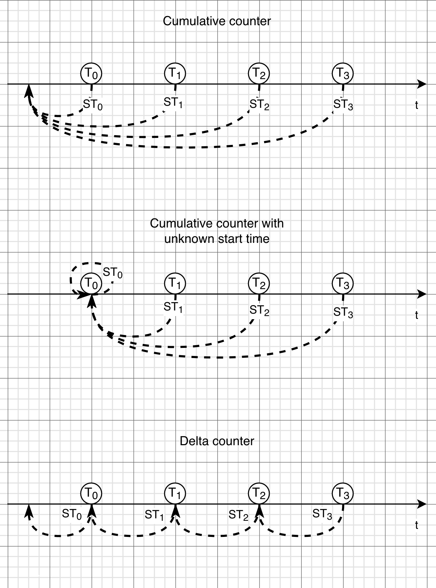

## Use start timestamps in `rate`-like functions for delta counter support

* **Owners:**
  * @vpranckaitis

* **Implementation Status:** `Not implemented / Partially implemented / Implemented`

* **Related Issues and PRs:**
  * `<GH Issues/PRs>`

* **Other docs or links:**
  * `<Links…>`

> TL;DR: Give here a short summary of what this document is proposing and what components it is touching. Outline rough idea of proposer's view on proposed changes.
>
> *For example: This design doc is proposing a consistent design template for “example.com” organization.*

## Why

The primary motivation for this proposal is the ["OTEL delta temporality support" project](https://github.com/prometheus/proposals/pull/48). This proposal aims to describe and detail the implementation of ["mini-cumulative" approach](https://github.com/prometheus/proposals/pull/48/changes#diff-a136211c73194731ce3a0cc5faadef9656ba10fa2f710aa2af25d246d2a09821R434-R453) for querying delta counters using `rate`-like functions. 

The implementation builds on Start Timestamps (ST), which is an evolution of Created Timestamps concept for cumulative counters (see ["Created Timestamp" proposal](0029-created-timestamp.md)). This proposal will also glance into whether some of the problems of the "Created Timestamp" proposal could be addressed (or at least not made worse), even if this is not the primary motivator for this proposal.

### Pitfalls of the current solution

Currently, Prometheus doesn't have a first-class support for delta counters. It is possible to ingest them as gauges and query them using `sum_over_time()` function. However, the preferred way to calculate the rate of the counter in Prometheus is the `rate()` function (and `increase()` for calculating increase), which currently doesn't work for delta counters.

## Goals

* Enable querying rate and increase of delta counters which have valid start timestamps.
* Improve increase detection of low-rate counters.
* The solution should be compatible with recently introduced `anchored` and `smoothed` modifiers.

### Audience

* Users of OTEL or other metrics ecosystems that would like to ingest delta counters and query them using PromQL engine.

## Non-Goals

* Improve rate extrapolation logic. 
* Try to fix the cases of invalid or conflicting start timestamps in query.

## How

For rate calculations, `rate`-like functions consider:
* Whether a counter reset has happened between each pair of subsequent datapoints. This is needed to calculate the total increase between the first and the last datapoint in the rate window.
* The gaps from rate window start to the first datapoint in the window, and from the last datapoint in the window to the window end. This is needed for rate extrapolation, and estimates the size of increase which should have happened at the ends of the rate window.

Since changes to rate extrapolation logic is beyond the scope of this proposal, we will be discussing only the reset detection changes between subsequent datapoints. However, it is important to note that `anchored` and `smoothed` modifiers move some datapoints to the start and end of rate window, thus creating extra pairs of subsequent datapoints. This has to be taken into account, so that no false resets would be detected.

### Short introduction to start timestamps

According to [OTel documentation](https://opentelemetry.io/docs/specs/otel/metrics/data-model/#temporality), start timestamps are recommended for Sum, Histogram and ExponentialHistogram datapoints. It describes the start of an interval since which the value is accumulated. For cumulative temporality timeseries start at time t<sub>0</sub>, you get intervals (t<sub>0</sub>, t<sub>1</sub>], (t<sub>0</sub>, t<sub>2</sub>], (t<sub>0</sub>, t<sub>3</sub>] and so on. For delta temporality, the accumulation are reset after every datapoint, so the intervals are (t<sub>0</sub>, t<sub>1</sub>], (t<sub>1</sub>, t<sub>2</sub>], (t<sub>2</sub>, t<sub>3</sub>], etc. In an unbroken sequence, start timestamps always match either the timestamp or start timestamp of another datapoint in the sequence. See the picture below for an illustration of this.



There is also a special case of unknown start timestamp in cumulative sequence. It is expressed by setting the start timestamps of the first datapoint in the sequence equal to its timestamps (ST<sub>0</sub> = T<sub>0</sub>). Following datapoints in the same sequence have the start time set equal to the start timestamp of the first datapoint, as in regular cumulative sequence. Care has to be taken to accurately calculate rate contribution with such sequences.

Earlier paragraphs have described start timestamps of unbroken sequences. However, things become more complex when a sequence is restarted, which would likely lead to gaps in the timeseries not covered by any datapoints. In real life misconfigurations might cause multiple sequences being written into a single timeseries. This could introduce partial overlaps between start time intervals, completely throwing off rate calculations.

### Detecting ST counter reset between two subsequent datapoints

This proposal suggests to look at no more than two subsequent datapoints at a time for reset detection, and thus process the datapoints inside `rate`-like function window pair by pair. It is enough to look at two subsequent datapoints and their start timestamps to tell whether a counter reset has happened in between them.

While looking at more datapoints might provide more insight about the behavior of the timeseries that is being processed, it might also increase likelihood of inconsistent results between query steps. For example, at some query step `rate()` function might make a decision by judging in tandem datapoints at T<sub>1</sub>, T<sub>2</sub> and T<sub>3</sub>. However, the same `rate()` function will only see datapoints T<sub>1</sub> and T<sub>2</sub> at an earlier step, and only datapoints T<sub>2</sub> and T<sub>3</sub> at a later step. If this leads to drastically different decision, the `rate()` function could produce ununiform results across the steps. 

Nevertheless, more than two datapoints could be analyzed for producing info and warning messages about ST values (e.g. if they are invalid, or if there is a collision between two timeseries).

The code snippet below shows the general logic needed to detect the counter resets.

```golang
type datapoint struct {
    ST, T int64 
    // ...
}

func detectResetFromStartTimestamp(prev, curr datapoint) bool {
    if curr.ST >= curr.T {
        // unknown or invalid start time
        return false
    }
	
    if curr.ST > prev.T {
        return true
    }
    if curr.ST < prev.T {
        return false
    }

    // if this place is reached, current ST is pointing to a previous datapoint

    if prev.ST == prev.T {
        // continuation of cumulative stream with unknown start time
        return false
    }
    return true
}
```

The following sections will describe in more detail the different cases of start timestamp counter reset detection.

#### Current datapoint with unknown ST

If the current datapoint has unknown start time (ST<sub>1</sub> = T<sub>1</sub>), then there's not much we can do other than falling back to counter reset detection from datapoint value. Note that due to this, unknown start timestamps should not be used for delta counters, since reset detection from values would produce invalid results.

#### Current datapoint has a known ST

For the cases where current datapoint has a known start time, it has to be considered in relation to the previous datapoint in the stream. If start timestamp points further away to the past than the previous datapoint (T<sub>0</sub> > ST<sub>1</sub>), then we assume that no reset has happened in-between current and previous datapoints. This is normal situation for cumulative counter streams. 

If the start timestamp points into the gap between previous and current datapoints (T<sub>0</sub> < ST<sub>1</sub> < T<sub>1</sub>), then we assume that there was a counter reset. This might happen if old cumulative / delta counter stream has finished and a new has started after some delay.

The situation where start timestamp points to the previous datapoint (T<sub>0</sub> = ST<sub>1</sub>) is slightly more complicated. This might be a continuation of delta counter stream, or it might be the second datapoint in a cumulative counter stream with unknown start time. For deltas, we should assume a counter reset, while there should be no counter reset in the cumulative stream case. To discern between these two cases, previous datapoint has to be checked whether it has an unknown start time (T<sub>0</sub> = ST<sub>0</sub>).


### `anchored` and `smoothed` modifiers

< TODO: `anchored` and `smoothed` modifiers adjust the placement of some datapoints. We have to make sure that this does not impact the counter reset detection using ST values. >

### Performance impact

< TODO: PromQL engine will have to propagate ST values to `rate`-like functions, which will consume extra memory. It would be best that the memory usage would be minimized for timeseries which doesn't have start timestamps, or if start timestamp feature flag is not enabled at all. >

> Explain the full overview of the proposed solution. Some guidelines:
> 
> * Make it concise and **simple**; put diagrams; be concrete, avoid using “really”, “amazing” and “great” (:
> * How you will test and verify?
> * How you will migrate users, without downtime. How we solve incompatibilities?
> * What open questions are left? (“Known unknowns”)

## Alternatives

The ["OTEL delta temporality support"](https://github.com/prometheus/proposals/pull/48/changes#diff-a136211c73194731ce3a0cc5faadef9656ba10fa2f710aa2af25d246d2a09821) mentions a few alternative approaches for querying delta counters, which were not selected due to technical or other reasons.

## Action Plan

* [ ] Task one `<GH issue>`
