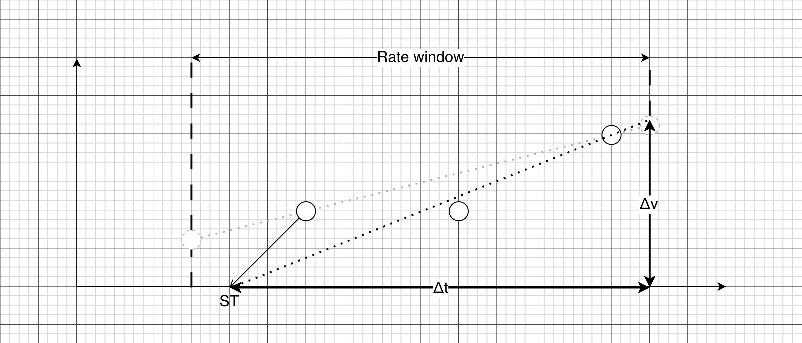
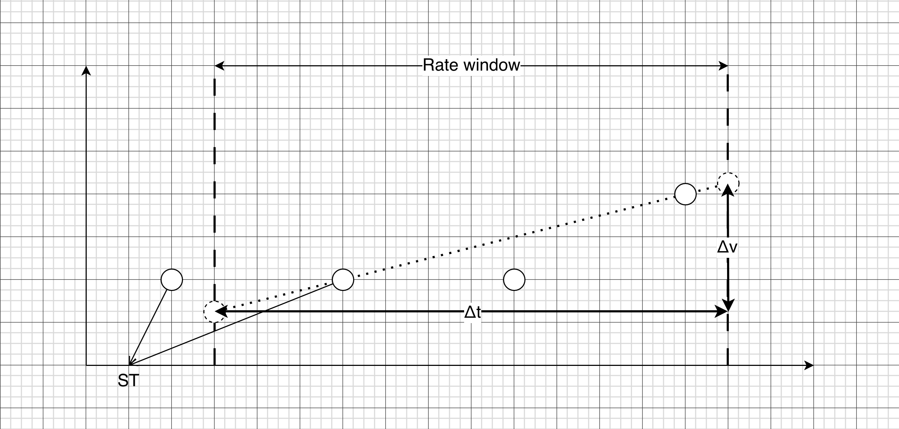
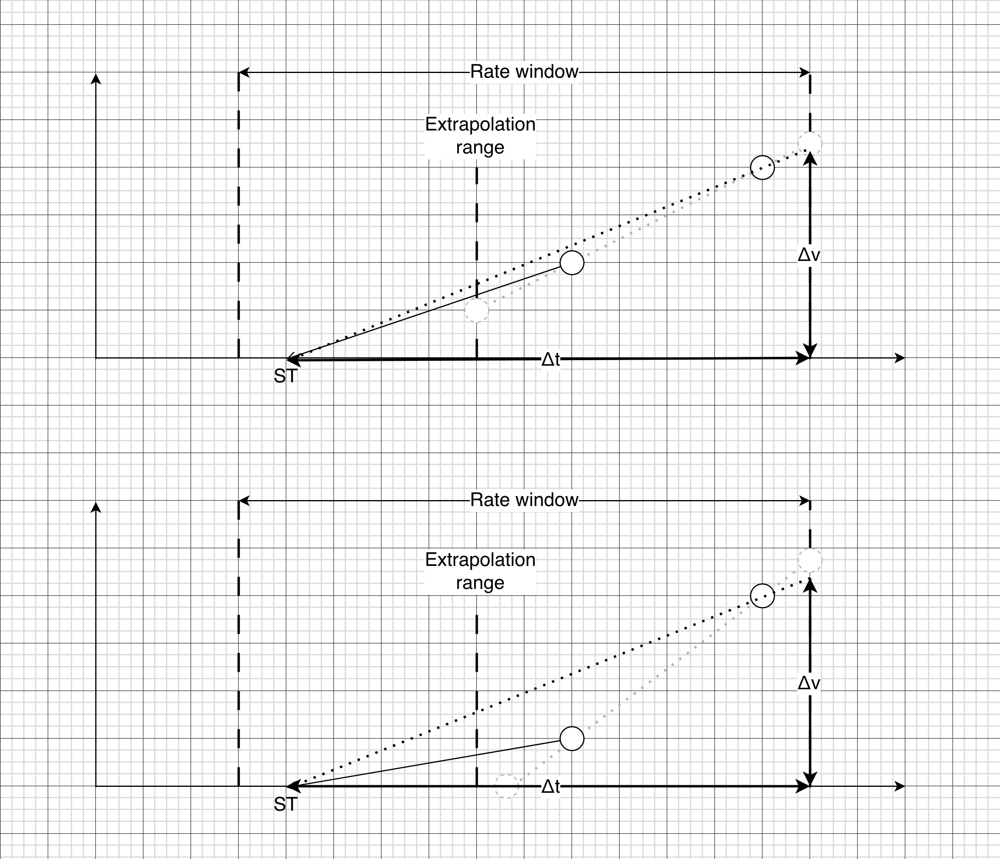
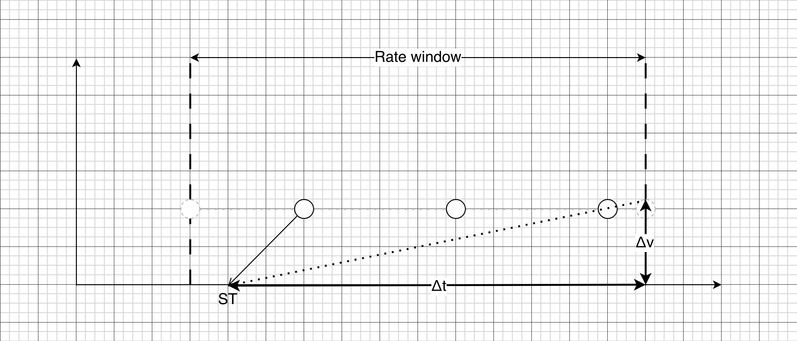
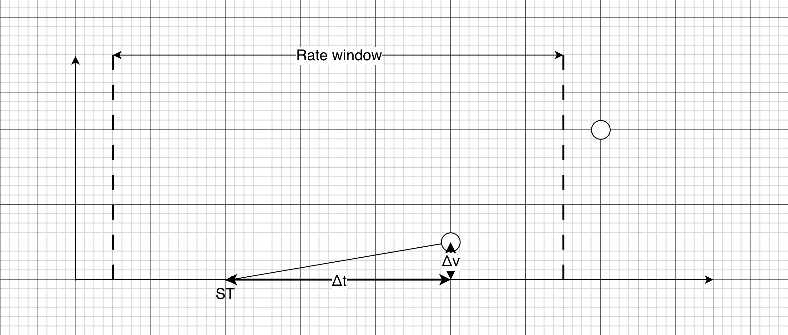
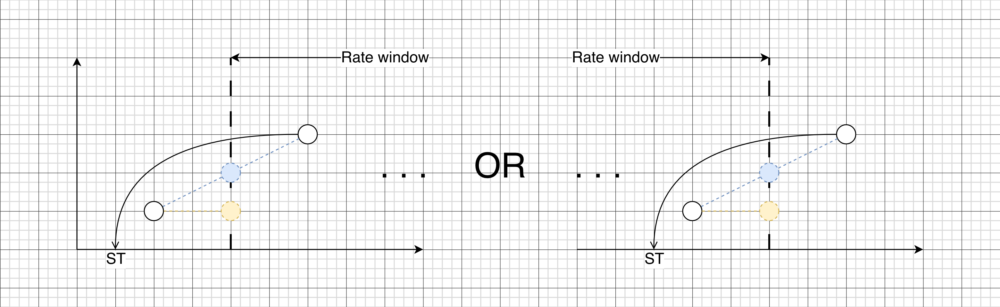
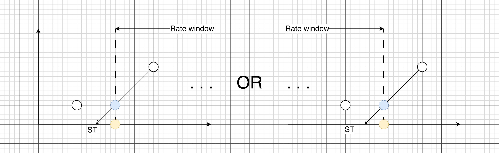
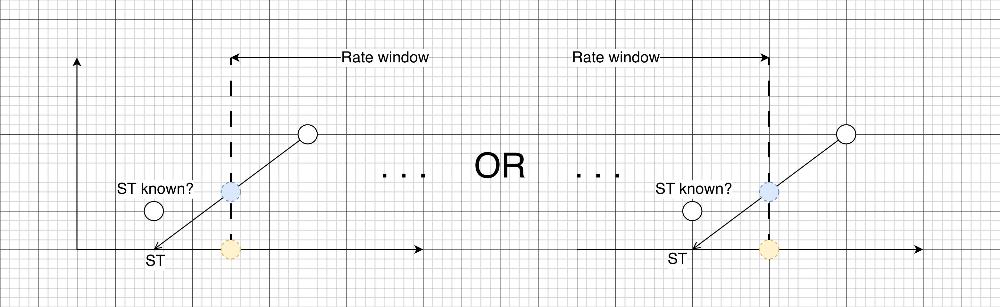
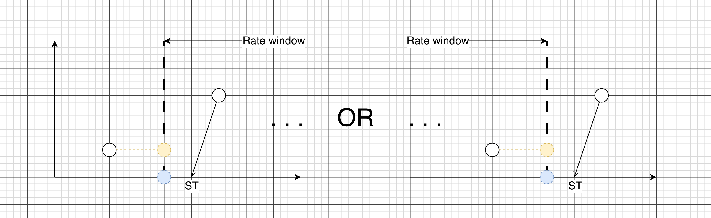
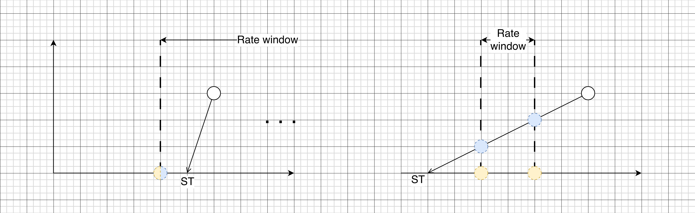

## Use start timestamps in `rate`-like functions for delta timeseries support

* **Owners:**
  * @vpranckaitis

* **Implementation Status:** `Not implemented / Partially implemented / Implemented`

* **Related Issues and PRs:**
  * PR: [PromQL: use start timestamps for rate()-like calculations](https://github.com/prometheus/prometheus/pull/18344)
  * PR: [PromQL: resets() function considers start timestamp resets](https://github.com/prometheus/prometheus/pull/18627)
  * PR: [PromQL: use start timestamps for rate extrapolation](https://github.com/prometheus/prometheus/pull/18619)

* **Other docs or links:**
  * `<Links…>`

> TL;DR: This document describes how start timestamps could be implemented in `rate`-like functions to enable delta timeseries support. Additionaly, start timestamps will improve accuracy of rate calculations for cumulative timeseries.

## Why

The primary motivation for this proposal is the ["OTEL delta temporality support" project](https://github.com/prometheus/proposals/pull/48). This proposal aims to describe and detail the implementation of ["mini-cumulative" approach](https://github.com/prometheus/proposals/pull/48/changes#diff-a136211c73194731ce3a0cc5faadef9656ba10fa2f710aa2af25d246d2a09821R434-R453) for querying delta counters using `rate`-like functions.

The implementation builds on Start Timestamps (ST), which is an evolution of Created Timestamps concept for cumulative counters (see ["Created Timestamp" proposal](0029-created-timestamp.md)). This proposal will also glance into whether some of the problems of the "Created Timestamp" proposal could be addressed (or at least not made worse), even if this is not the primary motivator for this proposal.

### Pitfalls of the current solution

Currently, Prometheus doesn't have a first-class support for delta counters. It is possible to ingest them as gauges and query them using `sum_over_time()` function. However, the preferred way to calculate the rate of a counter in Prometheus is the `rate()` function (and `increase()` for calculating increase), which currently doesn't work for delta counters.

## Goals

* Enable querying rate and increase of delta counters which have valid start timestamps.
* Improve increase detection of low-rate counters.
* The solution should be compatible with recently introduced `anchored` and `smoothed` modifiers.

### Audience

* Users of OTEL or other metrics ecosystems that would like to ingest delta counters and query them using PromQL engine.

## Non-Goals

* Try to fix the cases of invalid or conflicting start timestamps in query.

## How

For rate calculations, `rate`-like functions consider:
* Whether a counter reset has happened between each pair of subsequent datapoints. This is needed to calculate the total increase between the first and the last datapoint in the rate window.
* The gaps from rate window start to the first datapoint in the window, and from the last datapoint in the window to the window end. This is needed for rate extrapolation, and estimates the size of increase which should have happened at the ends of the rate window.

### Short introduction to start timestamps in OTel

According to [OTel documentation](https://opentelemetry.io/docs/specs/otel/metrics/data-model/#temporality), start timestamps are recommended for Sum, Histogram and ExponentialHistogram datapoints. It describes the start of an interval since which the value is accumulated. For cumulative temporality timeseries start at time `t[0]`, you get intervals `(t[0], t[1]]`, `(t[0], t[2]]`, `(t[0], t[3]]` and so on. For delta temporality, the accumulation are reset after every datapoint, so the intervals are `(t[0], t[1]]`, `(t[1], t[2]]`, `(t[2], t[3]]`, etc. In an unbroken sequence, start timestamps always match either the datapoint timestamp or start timestamp of another datapoint in the sequence. See the picture below for an illustration of this.


There is also a special case of unknown start timestamp in cumulative sequence. It is expressed by setting the start timestamps of the first datapoint in the sequence equal to its datapoint timestamps `(ST[0] = T[0])`. Following datapoints in the same sequence have the start time set equal to the start timestamp of the first datapoint, as in regular cumulative sequence. Care has to be taken to accurately calculate rate contribution with such sequences.

Earlier paragraphs have described start timestamps of unbroken sequences. However, things become more complex when a sequence is restarted, which would likely lead to gaps in the timeseries not covered by any datapoints. In real life, misconfigurations might cause multiple sequences being written into a single timeseries. This could introduce partial overlaps between start time intervals, completely throwing off rate calculations.

### Short introduction to start timestamps in Google Cloud Monitoring

Google Cloud Monitoring has strict guidelines for timeseries datapoint start timestamp and datapoint timestamps. The intervals between these two points are closed [ST, T]. The rules for acceptable values depend on the metric type:

* For gauges, start timestamp is optional, or if set, has to be equal to datapoint timestamp (i.e. ST=T, zero size interval).
* For delta metrics, start and datapoint timestamps must specify non-zero interval, and a sequence of datapoints should specify contiguous and non-overlapping interval, i.e. `ST[0] < T[0] < ST[1] < T[1] < …`.
* For cumulative metrics, start and datapoints timestamps must specify non-zero intervals (`ST < T`). Subsequent datapoints specify the same start timestamp, but increasing datapoint timestamps, i.e. `ST[0] = ST[1] = ST[2] = … < T[0] < T[1] < T[2]< …`. If there is a reset, the new start timestamp must be at least a millisecond after the previous interval end time, i.e. `T[n] < ST[n+1]`.

### OTel vs GCP start time intervals

As described, OTel and GCP start time intervals have some fundamental differences:
* Half-open intervals in OTel, closed intervals in GCP
* For unbroken streams in OTel, start timestamps match start or datapoint timestamp of some other datapoint. In GCP, only for unbroken cumulative streams matching values of start timestamp are allowed.
* Unknown start timestamp case for cumulative streams in OTel, where ST=T. In GCP, ST=T intervals are only allowed for gauges (for which start timestamp is optional).

The differences are significant and not cross-compatible from write perspective – OTel datapoint stream might require start timestamp adjustment before it can be ingested into Google Cloud Monitoring. However, from read and query perspective, the start timestamp intervals express the same notion with slight variantions in underlying priciples. Thus it should be possible to interpret start timestamps in `rate`-like functions in a way, which would work with both OTel and GCP compatible datapoint streams.

The box below displays how start timestamp intervals would look for equivalent timeseries, just expressed as delta or cumulative metrics, in OTel or Google Cloud Monitoring.

```
OTel delta:
  (ST0;  T0]
           (ST1;  T1]
                    (ST2;  T2]
                               ... (ST3;  T3] // new sequence
                    
OTel cumulative:
  (ST0;  T0]
  (ST1; --------- T1]
  (ST2; ------------------ T2]
                               ... (ST3;  T3]  // new sequence

OTEL cumulative with unknown start time:
           (ST0
         T0]
           (ST1;  T1]
           (ST2; --------- T2]
                                            (ST3;  // new or interrupted
                                          T3]      // sequence

GCP delta:
   [ST0; T0]
            [ST1; T1]
                     [ST2; T2]
                               ...  [ST3; T3]  // new sequence

GCP cumulative:
   [ST0; - T0]
   [ST1; -------- T1]
   [ST2; ----------------- T2]
                               ...  [ST3; T3]  // new sequence
```

### Detecting ST counter reset between two subsequent datapoints

This proposal suggests to look at no more than two subsequent datapoints at a time for reset detection, and thus process the datapoints inside the `rate`-like function window pair by pair. To tell whether there was a reset between two datapoints, it is enough to look at the start and datapoint timestamps of those two datapoints.

One might argue that looking at more datapoints might provide more insight about the behavior of the timeseries that is being processed, However, it might also increase likelihood of inconsistent results between query steps. For example, at some query step `rate()` function might make a decision by judging in tandem datapoints at `T[1]`, `T[2]` and `T[3]`
. However, the same `rate()` function will only see datapoints `T[1]` and `T[2]` at an earlier step, and only datapoints `T[2]` and `T[3]` at a later step. If this leads to drastically different decision, the `rate()` function could produce ununiform results across the steps.

Nevertheless, more than two datapoints could be analyzed for producing info and warning messages about ST values (e.g. if they are invalid, or if there is a collision between two datapoint streams).

The code snippet below shows the general logic needed to detect the counter resets.

NB: the code adopts the idea of transforming OTel unknown timestamp datapoints ST=T into ST=0, T. This idea was proposed in [PROM-60 proposal](https://github.com/prometheus/proposals/pull/60), and it works well with the Prometheus interpretation of ST=0, which means that the timestamp is unknown.

```golang
type datapoint struct {
    ST, T int64 
    // ...
}

func detectResetFromStartTimestamp(prev, curr datapoint) bool {
    if curr.ST == 0 || curr.ST > curr.T {
        // Unknown or invalid start time.
        return false
    }
    
    if curr.ST > prev.T {
        // OTel – new cumulative/delta sequence.
        // GCP - next delta datapoint in sequence, 
        // or new cumulative/delta sequence.
        return true
    }
    if curr.ST < prev.T {
        // OTel and GCP – continuation of cumulative sequence.
        return false
    }

    // If this place is reached, current ST is pointing to 
    // a previous datapoint. Thus this is OTel cumulative or 
    // delta sequence.

    if prev.ST == 0 {
        // Continuation of OTel cumulative stream with 
        // unknown start time.
        return false
    }
    return true
}
```

The following sections will describe in more detail the different cases of start timestamp counter reset detection.

#### Current datapoint with unknown ST

If the current datapoint has unknown start time (ST = 0), then there's not much we can do other than falling back to counter reset detection from datapoint value. Note that due to this, unknown start timestamps should not be used for delta counters, since reset detection from values would produce invalid results.

#### Current datapoint has a known ST

For the cases where current datapoint has a known start timestamp, it has to be considered in relation to the previous datapoint in the stream. If start timestamp points further away to the past than the previous datapoint (`T[0] < ST[1]`), then we assume that no reset has happened in-between current and previous datapoints. This is normal situation for cumulative counter streams.

If the start timestamp points into the gap between previous and current datapoints (`T[0] < ST[1] < T[1]`), then we assume that there was a counter reset. This might happen if old OTel or GCP, cumulative or delta counter stream has finished and a new has started after some delay. This is also a normal case for GCP delta sequence.

The situation where start timestamp points to the previous datapoint (`T[0] = ST[1]`) is slightly more complicated. This case is indicative of OTel datapoint sequence, since that is invalid in GCP. This might be a continuation of a delta sequence, or it might be the second datapoint in a cumulative sequence with unknown start time. For deltas, we should assume a counter reset, while there should be no counter reset in the cumulative sequence case. To discern between these two cases, previous datapoint has to be checked whether it has an unknown start time (`ST[0]= 0`).

### Rate extrapolation

Rate extrapolation is special logic in `rate()` and `increase()` functions. It tries to estimate how much a counter has increased before the first datapoint in the rate window, and after the last datapoint in the rate window. A detailed description how it works can be found in this [blog post by Julius Volz](https://promlabs.com/blog/2021/01/29/how-exactly-does-promql-calculate-rates/).

Start Timestamps could be used to also substitute rate extrapolation at the start of the rate window. If the ST of the first datapoint in the rate window also falls inside the rate window, we may treat as if there is a datapoint with a value of zero and the ST. See an example in the picture below.



It is important that the first datapoint ST would fall inside the rate window. If it doesn't, we cannot use it instead of rate extrapolation, because `rate()` / `increase()` function wouldn't have a complete view of the time span between ST and T of the first datapoint in the range. There might be datapoints that fall inside this ST–T span but outside the rate window (see the picture below), and thus it would be incorrect to project a 0 datapoint at ST. In an extreme case, the rate window might be far away from cumulative series start and thus also far away from the time where ST of the first datapoint in the rate window points to. In such case it would make little sense to use ST info to influence current rate window results, since it would in essence represent the averaged rate since the start of the counter.



Rate extrapolation also has special logic to limit the extrapolation distance (1.1 extrapolation range) and to avoid extrapolation below zero. Start Timestamp makes these irrelevant, because we know that the count was zero at ST, and extrapolating beyond that would lead to values below zero (or at best the extrapolated value would be zero if counter had no increases). See the picture below for illustration of these cases. Note that we do have to follow extrapolation distance and extrapolation below zero logic if first ST falls outside the rate window.



First ST as zero would also help getting more accurate results for low-rate counters that begin with a non-zero value (see the picture below). Currently, the `rate()` function returns 0 rate in such cases, and it is quite difficult to compose a query that would manage to capture such increase. This is a big problem for a particular class of use-cases (e.g. measuring HTTP error status codes which happen rarely and where it is wasteful to initialize in advance a counter for each possible values).



In addition, first ST as zero would allow calculating rate with just a single datapoint inside the rate window (see the picture below). This would be very helpful for querying the rate of a timeseries which consists of sole delta datapoints which are emitted from time to time without a stable cadence. Currently `rate()`-like functions require that the datapoints would be emitted at a predictable and reasonably frequent cadence, otherwise it is difficult to choose rate window size that would cover at least 2 (or better more) datapoints. With STs one would need to choose rate window size that would exceed the ST–T span sizes of all the (or majority of) datapoints.



However, when calculating rate from a single datapoint, it is impossible to find average distance between datapoints. So extrapolation to the right cannot be done, because we don't know how far we should extrapolate.

Note that while first ST could be treated as a zero value datapoint, it should not be treated as a real datapoint. For example, it should not be included in the calculation of average duration between successive datapoints. Including it would throw off the results, because depending on how a timeseries is ingested, ST is unlikely to be a whole step size before the initial datapoint in the timeseries.

It is also important to note that the first datapoint of a cumulative counter timeseries is equivalent to a datapoint of delta timeseries. So ST treatment for rate extrapolation will be exactly the same for cumulative and delta series.

### Extended range selectors: `anchored` and `smoothed` modifiers

Start timestamp support will also have to be implemented for extended range selectors. Unlike original `rate()` function, extended range selectors take a wider view of the rate window, which allows substituting extrapolation to the edges of the range window for interpolation at the edges of the window. So the handling of the start timestamps have to differ for the successive datapoints that cross the range window's edges. On the other hand, the handling is exactly the same for successive datapoints that fall fully inside the range window.

This section looks into different configurations of datapoints, their start timestamps and range window edges in relation to each other. It also describes how datapoints should be projected or interpolated in such cases.

The first case to consider is when there are two datapoints surrounding the range window's edge, but there are no ST reset between them (see the picture below). This might be because ST is unset (equals to 0), or it might go beyond the previous datapoint (as depicted in the picture below). In this case, we do not use ST for interpolation/projection and fallback to the reset detection from counter values.



However, a different treatment is needed when there is a ST reset between the datapoints surrounding the edge of the range window (see the picture below). If ST crosses the edge of the window, we then use if for interpolating the datapoints at the edge. For the `anchored` case, we simply project a 0 datapoint at the timestamp of the rate window's edge (yellow circle in the picture below). For the `smoothed` case, we interpolate a point alongside the line between the points `(ST, 0)` and `(T, <datapoint_value>)` (the blue circle in the picture below). It is important to note that for the right edge of rate window, the interpolated point might be above or below the previous datapoint. However, in both of these cases we should apply reset logic, since according to ST there was a reset between the last datapoint in the rate window and the right edge of the window.



There's a special case for OTel timeseries, where ST points to the timestamp of the previous datapoints (see the picture below). We then have to check whether it's an unknown start time. If it's unknown, there is no ST reset, and we fallback to the reset detection from counter values as described earlier. However, if the start time is known, we use ST–T line to interpolate as described in the previous paragraph (as depicted in the picture below).



One more case to consider is where the datapoints that surround the range window's edge has a ST reset between them, but the ST doesn't cross the window's edge (see the picture below). In this case, we would not use ST–T line for interpolation. However, we do have to take into account that there's a reset when interpolating the datapoints at the edge of the window, and also we have to consider this reset when taking into account counter resets inside the rate window. For example, in the picture below, for `anchored` case with yellow circle, we have to detect a ST counter reset after it, which cannot be detected just by looking at datapoint values. This means that we have to check whether ST points before or after the interpolated point.



There also are special cases related to sparse datapoints. When there are datapoints inside the range window, but there are no datapoints to the left of the window, we still have to check the ST location. If it falls inside the window (see the picture below, diagram on the left), we have to make sure that we set the value of the interpolated/projected datapoints to 0 (instead of using the value of the first datapoint in the window, which would happen if ST was not set).



Another interesting case is when there are no datapoints inside or to the left of the window, but there's a datapoint to the right of the window that has a ST (see the picture above, diagram on the right). Even in this case we could calculate a rate if ST–T line crosses one or both of the window edges (as long as the ST doesn't go too far to the left, beyond the lookback of the extended range).

### Performance impact

< TODO: PromQL engine will have to propagate ST values to `rate`-like functions, which will consume extra memory. It would be best that the memory usage would be minimized for timeseries which doesn't have start timestamps, or if start timestamp feature flag is not enabled at all. >

> TODO: Explain the full overview of the proposed solution. Some guidelines:
> * Make it concise and **simple**; put diagrams; be concrete, avoid using “really”, “amazing” and “great” (:
> * How you will test and verify?
> * How you will migrate users, without downtime. How we solve incompatibilities?
> * What open questions are left? (“Known unknowns”)

## Alternatives

The ["OTEL delta temporality support"](https://github.com/prometheus/proposals/pull/48/changes#diff-a136211c73194731ce3a0cc5faadef9656ba10fa2f710aa2af25d246d2a09821) mentions a few alternative approaches for querying delta counters, which were not selected due to technical or other reasons.

## Action Plan

* [ ] Task one `<GH issue>`
