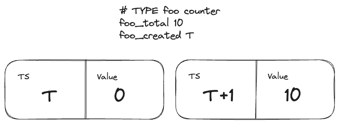
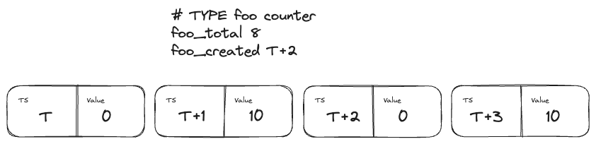

## Created Timestamps

* **Owners**
  * Arthur Silva Sens ([@ArthurSens](https://github.com/ArthurSens))
  * Bartłomiej Płotka ([@bwplotka](https://github.com/bwplotka))
  * Max Amin ([@macxamin](https://github.com/macxamin))
  * Daniel Hrabovcak ([@TheSpiritXIII](https://github.com/TheSpiritXIII))

* **Implementation**: Partially implemented

* **Related Issues and PRs:**
  * https://github.com/prometheus/prometheus/issues/6541

* **Other docs or links:**
  * https://docs.google.com/document/d/1kakDVn8aP1JerimLeazuMfy2jaB14W2kZDHMRokPcv4/edit

> We propose that created timestamps be exposed by common exposition formats. During scrape, created timestamps are processed before normal sample values. They are ingested as a "synthetic" sample with a value of 0 and a timestamp equal to the created timestamp found in the scrape, followed by appending the actual sample with the usual scraped value timestamp.
>
> Additionally, created timestamps are added to time series metadata to be propagated via remote-write.

## Why

Prometheus counters are one of the most useful metric types in Prometheus. Thanks to monotonous characteristics and simple semantics it allows cheap and reliable calculations of rate/increase/delta (called “rates” in this document), even in the event of missed scrapes.

This worked well for years, but certain edge cases started to impact the community:
* Common problems of uninitialized counters occur. We don’t know when the metric with value 0 started, so the counter starts with the incremented value. This can impact visualization and alerting.
* Counter resets can go undetected if a counter is quickly incremented after a counter reset so that the next scrape sees a value that is higher than the value during the last scrape before the counter reset.
* Finding absolute value for longer metrics is expensive as one has to go sample by sample to detect resets. This impacts ingestors as it requires stateful algorithms that discern between new metrics and long-running ones it did not see before, as well as advanced algorithms like the read-level deduplication algorithm in Thanos.

Furthermore, the same problems occur for Summaries and Histograms (old and native ones) since all of them are represented by counters.

### Pitfalls of the current solution

Rate-like functions calculate relative differences between 2 points in time, naturally, it requires at least 2 data points to be able to perform any calculations. For the most common cases, it works well for rates over long time ranges since it is likely that several data points were ingested.

However, it falls short for rates that englobes the data point collected in the first scrape of an application, or when using rates against metrics ingested from push-based applications with long push intervals, because only one data point is present in such occasions.

## Goals

* Prometheus can collect and store reset timestamps for counters, summaries, and histograms on scrape using common exposition formats.
* Prometheus will persist the created timestamp across restarts (WAL).
* Prometheus can perform meaningful rate-like functions even with a single scrape.
* Prometheus can inject created timestamps for stateless remote write use.
  * Stateless means here that every streamed batch of samples for certain counters has its created timestamp known.

### Audience

* Users monitoring push-based applications with long push intervals.
* Users depending on high-precision rates, especially during the initial scrapes of an application.
* Users that are sending metrics to ingestors that require created timestamp, e.g. Monarch.

## Non-Goals

* Propose changes to Prometheus text exposition format for now. Advanced functionalities like exemplars, native histograms, or created timestamps are not on the short-term roadmap.
* Elaborate on technical details for rate implementation.
* Remote Write extensions (should be in different proposals).
* Support Gauges and Gauge-like metrics (Info, Stateset, Gauge Histograms). None of the exposition formats allows this, thus it’s out of scope.

## How

We propose to append a newly appearing created timestamp as an additional 0-value sample to the TSDB. We call this a “zero injection”.

During a scrape, created timestamps are processed before normal sample values. If a certain metric is not yet present in the TSDB, a “synthetic” sample is appended with a value of 0 and a timestamp equal to the created timestamp found in the scrape. Followed by appending the actual sample with the usual scraped value and timestamp.



On following scrapes, created timestamps are not appended until a scrape finds a created timestamp higher than the latest sample's timestamp, which would trigger the insertion of another sample with a 0-value sample.



This is already enough to improve rate calculations as mentioned in the [Goals](#goals) section, while also persisting such data in WAL (even if not explicit) and although it allows an easier implementation, it comes with few limitations:

* Unable to ingest created timestamps out of TSDB Head range.
* Unable to help ingestors that require created timestamps as a separate field, as they would need to implement stateful logic to identify injected zeros in a batch of samples.

For those reasons, created timestamps will also be stored as metadata **per series**, following the similar logic used for the zero-injection.

### Collection

We propose created timestamps to be supported when Prometheus is used with Prometheus protobuf format, OpenMetrics proto, and text formats. Let’s explore each case:

#### Prometheus Protobuf

Since Prometheus already supports scraping endpoints with Prometheus protobuf and knowing that adding the created timestamp field is trivial, it makes Prometheus protobuf the preferred option for initial implementation:

```proto
message Counter {
  optional double   value    = 1;
  optional Exemplar exemplar = 2;
  optional google.protobuf.Timestamp    created_timestamp = 3;
}

message Summary {
  optional uint64   sample_count = 1;
  optional double   sample_sum   = 2;
  repeated Quantile quantile     = 3;
  optional google.protobuf.Timestamp    created_timestamp = 4;
}

message Histogram {
  // …
  repeated double positive_count    = 14; // Absolute count of each bucket.
  optional google.protobuf.Timestamp  created_timestamp = 15;
}
```

Once the protocol is extended, the Prometheus parser can easily identify created timestamps and ingest as mentioned in the [How](#how) section.

#### OpenMetrics Protobuf

Follows the same semantics as mentioned in [Prometheus Protobuf](#prometheus-protobuf), but Prometheus still isn't able to parse it.

The task here is to simply implement the missing parser.

#### OpenMetrics text

For OpenMetrics text the situation is more complex. For OM text format, the _created timestamps series would be normally ingested as a normal series. However, for this solution, we propose to capture the timestamp from the series and treat it as the synthetic zero. Then we propose to remove the artificial series to avoid further metric collisions, semantic differences (series vs. created timestamp metadata), and consistency with other exposition formats.

The removal of a special metric is a **breaking change**. However, we still propose doing it to stop the spread of this confusing pattern in the community (with adequate warning). The current usage of created metrics is low and users are [actually not adopting OM](https://github.com/prometheus/client_python/tree/v0.17.1#disabling-_created-metrics) for that reason. Thus allowing users to opt out (users can set if they want to preserve those metrics) seems like a good way forward.

Note that, the conversion of _created series to created timestamp append will not be a trivial, or efficient code. We have to check various metrics, and buffer appends of potentially related metrics. Ideally, this will go away from the next version of OpenMetrics text (outside of the scope of this proposal).

### Feature flag

Zero injection comes with a change to sample intervals. We inject samples every time a created timestamp is higher than the previously ingested sample's timestamp, meaning that the timestamp difference between two samples is no longer equal to the scrape interval. This behavior will change the results of functions that depend on such intervals, such as `count_over_time`.

Also, as mentioned in [OpenMetrics text](#openmetrics-text), changing the behavior of the OpenMetrics parser to drop time series that represents the created timestamp can come as a big surprise to existing users.

To avoid surprises, all the functionality mentioned in this proposal will be hidden behind a feature flag called "created-timestamp-ingestion".

## Alternatives

### Inject sentinel values

Instead of injecting zero samples, a sentinel value, e.g. *CreatedNaN* could be ingested instead to avoid confusion when noticing that not all samples follow the configured scrape interval.

It would also help remote-write ingestors to easily identify created timestamps in a batch of samples.

It would require refactoring of rate-like functions, where sentinel values would need to be replaced with zeros.

### Created timestamps as time series

Prometheus can already parse and ingest created timestamps from OpenMetrics text format. However, currently, it is ingested as a new time series.

It comes with a stream of downsides, though:
* A source of friction for adopting OpenMetrics text format for Prometheus users.
* Inconsistent with OpenTelemetry and OpenMetrics proto format.
* Confusing and surprising semantics by adding special series that have to be used especially. The link to related series is also poor and prone to errors.
* Metric name collisions - there might be user’s metrics with _created suffix that means something else.
* Inefficient storage, leading up to a 50% memory increase if the instance ingests mostly counters. This is because each series adds indexing overhead. The created timestamp semantics allow for significantly more efficient storage if we treat them not as a series but tailored to its APIs. Additionally, increases network utilization as more data is being scraped and transferred over the wire.
* Inefficient and error-prone usage. rate(), increase(), and delta() functions would need to perform extra queries to TSDB to find restarts and staleness. Metrics with clashing names might provide unexpected results.

## Action Plan

* [X] Extend Prometheus protobuf with created timestamps. https://github.com/prometheus/client_model/pull/66
* [X] Implement created timestamps in client_golang. https://github.com/prometheus/client_golang/pull/1313
* [ ] Implement parsing and zero-injection of created timestamps in Prometheus.
* [ ] Implement created timestamps as time series metadata.
