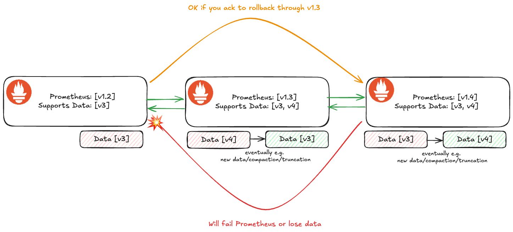

## Recommendations for WAL Format Changes

* **Owners:**
  * [@bwplotka](https://github.com/bwplotka)

* **Contributors:**
  * [@krajorama](https://github.com/krajorama)
  * [@bboreham](https://github.com/bboreham)
  * [@carrieedwards](https://github.com/carrieedwards)

* **Implementation Status:** Not implemented [prototype](https://github.com/prometheus/prometheus/pull/15565)

* **Related Issues and PRs:**
  * https://github.com/prometheus/prometheus/issues/15200
  * https://github.com/prometheus/prometheus/issues/14730
  * [WAL changes for NHCB](https://docs.google.com/document/d/1oYmvK7rrRFNrkM4Hrze8OsaK4z0GGj4pXl6VT6S_ef0/edit?tab=t.0#heading=h.545ogb8wlxze)
  * [Segment versioning prototype](https://github.com/prometheus/prometheus/pull/15565)

* **Other docs or links:**
  * [`#prometheus-wal-dev`](https://cloud-native.slack.com/archives/C082ALTBY4S)
  * https://github.com/prometheus/prometheus/blob/main/tsdb/docs/format/wal.md
  * [Ganesh's blog](https://ganeshvernekar.com/blog/prometheus-tsdb-the-head-block/)

> TL;DR: We need to break forward compatibility of the WAL format. This document proposes a data migration strategy for WAL and a lightweight ways we can be more transparent about those in each Prometheus release. 
> 
> We propose to version WAL by segments; with the version in the filename e.g.`00000002-v2`. For the migration, we propose the *LTS-enhanced [Two-Fold Migration Strategy](#how-two-fold-migration-strategy) with a `--storage.<...>.wal-version` flag for each Prometheus mode*.

## Glossary

For this document, I use the following wording:

* **Prometheus Backward Compatibility**: When new Prometheus can read old WAL format.
* **Prometheus Forward Compatibility**: When old Prometheus can read the new WAL format, which is required for the potential reverts.
* **WAL Breaking Change**: Change to the WAL that will break Prometheus backward or forward compatibility, e.g. adding a new format that will replace the existing one.

In this document, data "compatibility" means both:

* Prometheus won't crash during compatible rollout or reverts. 
* No data is lost during compatible rollouts or reverts.

## Why

Recently we discussed various improvements to Prometheus Write-Ahead-Log (WAL, also used as WBL for OOO) to:

* Support new features (e.g. created timestamp (CT), native histograms with custom buckets (nhcb)).
* Efficiency improvements and tech debt cleanup (e.g. parallelization/sharding, combining records, different decoding formats).

The [current WAL data](https://github.com/prometheus/prometheus/blob/975d5d7357a220192fe1307b10ded9b35130ab1c/tsdb/docs/format/wal.md) is written into a handwritten variadic-encoding binary format. It's generally not versioned, and it does not support unknown fields or data except 3 specific places:

* [record type](https://github.com/prometheus/prometheus/blob/e410a215fbe89b67f0e8edef9de25ede503ea4e0/tsdb/record/record.go#L38)
* [metric type in metadata record](https://github.com/prometheus/prometheus/blob/e410a215fbe89b67f0e8edef9de25ede503ea4e0/tsdb/record/record.go#L111)
* [metadata fields are arbitrary labels in metadata record](https://github.com/prometheus/prometheus/blob/e410a215fbe89b67f0e8edef9de25ede503ea4e0/tsdb/record/record.go#L608).

Historically, we didn't hit major problems because we were only adding new semantic data (e.g. exemplars, metadata, new native histograms) as new records. 
However, these days, we need to add features to existing data (e.g. custom buckets that will replace classic histograms, cleanup of histogram records or created timestamps to samples). Even if we create a new record for those and use it for new samples, any rollback will **lose that information as they appear unknown in the old version**.

For the TSDB changes (see the [context](#context-tsdb-format-changes), tribally, we use an undocumented ["2-fold" migration strategy](#how-two-fold-migration-strategy). However, WAL data is typically significantly smaller, around ~30m worth of samples (time to gather 120 samples for a chunk, for 15s intervals), plus 2h series records in WAL.

### Pitfalls of the current solution

* We don't have an officially documented migration strategy for WAL and TSDB in general (only tribal knowledge).
* Users don't know if version X of Prometheus works with version X-2 (except on some minor release that makes the change).
* No e2e testing for migration strategies, no consistent documentation when this happens on releases.

As a result:

* Reduced contribution and development velocity, prolonging bugs, important features and efficiency efforts.
* Increased operational cost and reduced trust for users who run highly durable Prometheus setups.

### Context: TSDB format changes

TSDB format, including chunk format (also used in the head with mmapped chunks), is also a handwritten variadic-encoding binary format. Compared to WAL it's generally versioned e.g.

* [Chunk disk file format](https://github.com/prometheus/prometheus/blob/12c39d5421cc29a4bfc13fc57fd9ccd3dbc310f0/tsdb/docs/format/chunks.md#L14).
* [Head chunk disk format](https://github.com/prometheus/prometheus/blob/fd62dbc2918deea0ceae94758baf7a095b52dd5b/tsdb/docs/format/head_chunks.md#L13).
* [Index file](https://github.com/prometheus/prometheus/blob/d699dc3c7706944aafa56682ede765398f925ef0/tsdb/docs/format/index.md#L8).
* [Block meta file](https://github.com/prometheus/prometheus/blob/5e124cf4f2b9467e4ae1c679840005e727efd599/tsdb/block.go#L171).
* Chunks have its own ["encoding type"](https://github.com/prometheus/prometheus/blob/a693dd19f244f000da40bcbac85041846b78cfc1/tsdb/chunkenc/chunk.go#L29) that could be used for versioning.

No docs or formal strategy was developed, but Prometheus generally follow the ["2-fold" migration strategy explained below](#how-two-fold-migration-strategy).

## Goals

* Agree on the official recommendations for **lossless WAL migrations** strategies for devs and users.
* Balancing development velocity with user data stability risks.
* Ability to develop new version across releases in `main` branch.

## Non-Goals

* TSDB format can, but does not need to follow the same recommendations. We want to change the WAL format now, so prioritizing WAL.
* Mentioning Write-Before-Log (WBL) or checkpoints, both uses WAL format internally.
* To reduce the scope we don't mention [memory snapshot format](https://github.com/prometheus/prometheus/blob/fd5ea4e0b590d57df1e2ef41d027f2a4f640a46c/tsdb/docs/format/memory_snapshot.md#L1) for now.

## How

We recommend the [Two-Fold Migration Strategy](#how-two-fold-migration-strategy) with the two important additions:

* A new flag that tells Prometheus what WAL version to write.
* There can be multiple "forward compatible" versions, but the official minimum is **the previous [Long-Term-Support (LTS) release](https://prometheus.io/docs/introduction/release-cycle/)**. The forward compatibility can be optionally backported to the LTS, instead of waiting up to a 1y, depending on the risk.

An example flow could look as follows:

1. Prometheus LTS 3.1 only supports WAL v1.
2. Prometheus 3.3 adds WAL v2.
3. We wait unit next LTS so e.g. 3.24.
4. Prometheus 3.25 can now switch to WAL v2.
5. Prometheus 4.0 can remove WAL v1 support.

In terms of flag, we propose to add an integer `--storage.<tsdb|agent>.wal-version` flag, with the default to `1`. The flag tells Prometheus to write a particular WAL ve for both WAL and WBL. Similar to other flags like compression it has `stateful` consequence: once new version is used, users will be able to revert only to certain Prometheus versions. Help of this flag will explain clearly what's possible and what Prometheus version you will be able to revert to. We will change the default for this flag to a new version ONLY when (at least) one previous LTS Prometheus version can read that version (while writing the old one). The initial version would be `1`. Rationales for flag are [explained later](#how-why-flag).

The proposed flag definitions:

```go
	serverOnlyFlag(a, "storage.tsdb.wal-version", fmt.Sprintf("Version for the new WAL segments. Supported versions: %v. Version 1 is supported since v2.40+", wlog.ReleasedSupportedSegmentVersions())).
Default(fmt.Sprintf("%v", wlog.DefaultSegmentVersion)).Uint32Var(&cfg.tsdb.WALSegmentVersion)

    agentOnlyFlag(a, "storage.agent.wal-version", fmt.Sprintf("Version for the new WAL segments. Supported versions: %v. Version 1 is supported since v2.40+", wlog.ReleasedSupportedSegmentVersions())).
Default(fmt.Sprintf("%v", wlog.DefaultSegmentVersion)).Uint32Var(&cfg.agent.WALSegmentVersion)
```
 
To achieve WAL versioning we also propose to start versioning the WAL. This is necessary to communicate a breaking change and to tell Prometheus what WAL format to write in.
 
Given the WAL [format](https://github.com/prometheus/prometheus/blob/main/tsdb/docs/format/wal.md) is technically a "WAL Segment format" (WAL consists of list of segments), we propose to version WAL per segment. We propose capturing the version in the filename. This changes the segment filename format as follows:

```
<8 digit sequence> => <8 digit sequence>[-v<version>]
```

For example, following filenames would be now valid: `00000010`, `00000010-v1`, `00000010-v2`, `00000010-v24`. The filename based segment versioning has the following benefits:

* We can cleanly mix different versions of segments in Prometheus.
* It's relatively simple to implement (lots of LOC changed though, see [the prototype](https://github.com/prometheus/prometheus/pull/15565)).
* Current Prometheus code [will, generally, naturally skip segments with unknown version in the Prometheus versions prior to this change](https://github.com/prometheus/prometheus/blob/addaf419efba330c1e8bc7b2c7d59e878b8ac71a/tsdb/wlog/wlog.go#L931). In the worse places we will see ["not a valid filename" errors](https://github.com/prometheus/prometheus/blob/addaf419efba330c1e8bc7b2c7d59e878b8ac71a/tsdb/wlog/wlog.go#L163).
* Quick glance over `wal` or `wbl` directory tells if the migration to a next version happened or not.
* We can extend the filename format in future segment version, cleanly e.g. another suffix for sharding.

The mixed situation could look as follows:

```
wal/ 
├── 00000000
├── 00000001-v2
├── 00000002-v2
├── 00000003-v2
├── 00000004
├── checkpoint.00000001
│   └── 00000000
├── checkpoint.00000003
│   └── 00000000-v2
└── checkpoint.00000004
    └── 00000000
```

We propose to document that behaviour in:

* dedicated guide for users
* flag help
* tsdb/docs for devs

Finally, we propose that all Prometheus releases will contain the content similar to the following one:

| Data        | Supported | Writes |
|-------------|-----------|--------|
| WAL         | v1, v2    | v1     |
| Block index | v2        | v2     |

```
The last revertable Prometheus version: v3.0.0 
```

See the [alternatives](#alternatives) for other ideas.

### How: Why Flag?

There are two reasons for the flag:

* Allows users to get the new features sooner and skip the safety mechanism.
* It simplifies the compatibility guarantees as the flag default mechanism guides users and devs in the rollout and revert procedures e.g:
  * when we switch to writing v2, it's clearly visible in a flag default value. 
  * when we at some point remove support of WAL v1, it's clear when it happens (`v1` flag value is removed).
* It allows users to set Prometheus to write the old format if needed (de-risking further).
* Gives devs quicker feedback, makes testing easier, and motivates further contributions.

### How: Two-Fold Migration Strategy

Given the following example:



1. We release Prometheus X+1 version that supports both Y and Y+1 data but still writes Y.
2. We release Prometheus X+2 version that supports both Y and Y+1 data, but now it writes new data as Y+1.

While this example shows only one version where of forward compatibility (when Y and Y+1 are supported, but Y is still written), in practice there could be more "forward compatible releases" within this strategy.

Technically we have to keep old format read (and write) support until the next major release.

Pros:
* Users have a durable rollout path back and forth.
* Dev has clarity on how to develop "breaking revert" changes.
* In theory, it allows revert to X from X+2, by going through X+1 and ensuring all data was migrated (eventually) to Y version. In practice however that eventuality is long, or hard to discover.

Cons:
* It can catch users by surprise.
  * **Mitigation**: We also plan guide and documentation and support LTS release.
* It takes time to rollout new changes if you want them fast.
  * **Mitigation**: We plan to add a flag to opt-in sooner.

## Alternatives

### Alternative: Different separator than `-v`

We might want to use different format than

```
<8 digit sequence>[-v<version>]
```

For example, `.` would be perhaps more visually appealing. 

Cons:
* `.` might be confused with the file extension.

### Alternative: Capture segment version in a segment header

Instead of the filename we could capture the segment version in the preamble or header in the binary format.
This would be more consistent with other files e.g. [`chunks`](https://github.com/prometheus/prometheus/blob/main/tsdb/docs/format/chunks.md#chunks-disk-format) or [`index`](https://github.com/prometheus/prometheus/blob/main/tsdb/docs/format/index.md).

Header might be also easier to implement (less LOCs) and a bit more efficient.

Cons:
* Breaks the design of WAL segment being and array of records with preamble, which was inspired by LevelDB.
* You have to parse each segment programmatically to know what it's version. This will make debugging much harder in case of errors. Additionally, it would be hard to tell when the migration fully completed in the user's directory.
* Accidental use of old Prometheus on new format would result in the corruption error, which is not ideal (it's hard to debug such errors in the future)

### Alternative: Capture segment version in a special record

Instead of special header or filename, we could specify a segment version in the special new record type that has to be first in the segment.

This has a nice benefit of clean handling of new records for old Prometheus.

Cons:
* Similar cons to [header](#alternative-capture-segment-version-in-a-segment-header) around debuggability.
* Introduces snowflake, special record, which is not technically a proper record (e.g. it has to be first)
* Perhaps failing fast is better (e.g. when parsing filename) vs treating new records as empty?

### Alternative: Version WAL per directory.

Instead of the segment versioning, we could propose the addition of a `meta.json` file in the wal directory, similar to [block meta.json](https://github.com/prometheus/prometheus/blob/5e124cf4f2b9467e4ae1c679840005e727efd599/tsdb/block.go#L171), with Version field set to `1` for the current format and `2` for new changes e.g. when we start to write [new records](https://github.com/prometheus/prometheus/pull/15467/files). No `meta.json` is equivalent to `{"version":1} `meta.json` file.

We could propose to also store the new WALs in separate directories e.g. `wal.v2`. Thanks to that the rewrite from one version to another is **eventual** and can be done segment by segment without any forcible rewrite. The WAL will be rewritten within the next 2h of a normal operation. The additional advantage of this way of versioning is that it's clear when your WAL fully migrated to a certain version.

Cons:
* Semantics on reading mixed WAL situation it's more complex to get right.

### Alternative: Record-based WAL versioning

Given we usually change WAL by changing its records, the WAL version could be simply [max number of types](https://github.com/prometheus/prometheus/blob/5e124cf4f2b9467e4ae1c679840005e727efd599/tsdb/record/record.go#L54) we write to WAL.

### Alternative: Maintain two WALs (well four, with WBL)

Duplicating records would be too expensive for already painful latency and CPU/mem usage for e.g. replay.
However, we could write an entirely new WAL with only a disk latency and space penalty, on top of writing old one, for compatibility.

Cons:
* Disk space increased
* Inconsistent with the TSDB format strategy.
* Complex to implement.

### Alternative: Add a CLI tool that rewrites WAL to a specific version

We could add a `promtool` command that rewrites WAL segments to a given version.

Users can then migrate their WAL with a single command either as an init process before reverting or manually on a disk.

This should take ~minutes even for larger WAL files.

Pros:
* Less need for a two-fold strategy?

Cons:
* We need to write migration code and ensure it's efficient enough for bigger data
* A bit painful to use on scale and remotely (e.g. on Kubernetes)

### Alternative: Rewrite WAL before/during replay

Instead of supporting multiple directories for WAL for various versions, we could rewrite WAL on the start.

Pros:
* Simpler implementation

Cons:
* We already suffer from replay problems, so I propose an eventual rewrite.
* Rewrite is more risking than read-only WAL (of previous version)

### Alternative: Don't version WAL, don't introduce a flag

Pro:
* One issue with a flag is that we lose "automatic" rollout for some users e.g. what if we will have another v3 WAL version, but users sets an explicit `--storage.tsdb.stateful.write-wal-version=v3` option? For those users they will need to make a manual choice and there might be not aware of benefits of a new WAL or do any work to test new WAL for their setup. With raw two-fold strategy format is forced, but also transparent (if without issues).

Cons:
* Takes more time for features to be available to users
* Demotivating for format changes (long feedback loop)
* Harder to communicate what exactly changed in each Prometheus version or even implement backward compatibility?

### Alternative: Use feature flag instead

Instead of `--storage.tsdb.stateful.write-wal-version` we could add a feature flag like logic.

We could add a flag that is similar to the current feature flags `--enable-feature`, but it has a "stateful" consequence -- once used, users will be able to revert only to certain Prometheus versions. For example a new `--enable-stateful-feature` flag to signal that behaviour.

Pros:
* No new flags for other storage pieces

Cons:
* No clear logic for defaulting here
* No clear ability to force Prometheus to write to wal v1 here unless we add a "feature flag value" for v1, which is odd.

## Action Plan

The tasks to do in order to migrate to the new idea.

* [ ] Introduce segment based versioning; [pending PR](https://github.com/prometheus/prometheus/pull/15565).
* [ ] Document WAL proposed recommendation for devs and users.
* [ ] Ensure each release of Prometheus mention either each version of the data format or what Prometheus version you can roll back it to.
