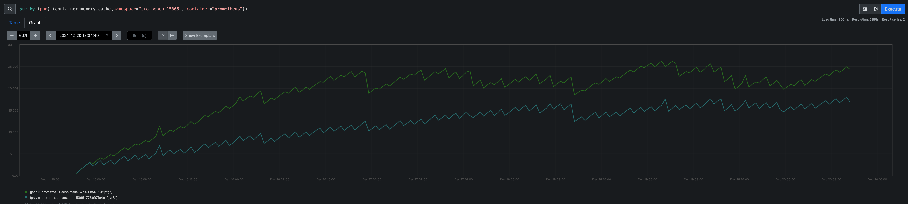

# Direct I/O

* **Owners:**
  * [@machine424](https://github.com/machine424)

* **Implementation Status:** Partially implemented

* **Related Issues and PRs:**
  * [Prometheus PR #15365](https://github.com/prometheus/prometheus/pull/15365)

* **Other Docs or Links:**
  * [Slack Discussion](https://cloud-native.slack.com/archives/C01AUBA4PFE/p1726674665380109)

> This effort aims to experiment with direct I/O to determine whether it can enhance user
experience and provide performance improvements.

## Why

Probably due to a lack of [understanding of good taste](https://yarchive.net/comp/linux/o_direct.html).

The motivation behind this effort is to address the confusion surrounding page cache behavior,
particularly in environments where various memory-related statistics and metrics are available; for
instance, see [this issue](https://github.com/kubernetes/kubernetes/issues/43916) regarding
containerized environments.

This initiative was prompted by [@bboreham](https://github.com/bboreham)
(refer to [the Slack thread](https://cloud-native.slack.com/archives/C01AUBA4PFE/p1726674665380109)).
The effort aims to prevent misunderstandings and concerns regarding increased page cache usage, which
might lead users or admins to make poor decisions, such as allocating more memory than necessary.
Moreover, bypassing the cache when it is not required can help eliminate the overhead of data copying
and reduce additional kernel overhead from reclaiming the cache. Thus, any performance improvements
achieved through direct I/O are welcome.

### Pitfalls of the Current Solution

In addition to the issues mentioned above, sometimes the page cache generated during writes is not
used at all. For instance, once chunks are written during compaction, they are opened via
`mmap`, which renders the page cache produced during writing redundant and useless.

## Goals

* Reduce concerns and misconceptions about page cache overhead caused by writes.
* Establish a foundation and gain familiarity with direct I/O; even if it proves unsuccessful in
this context, the knowledge can be applied elsewhere.

### Audience

## Non-Goals

* Switch all reads/writes to direct I/O.
* Eliminate the page cache, even if it results in significantly increased CPU or disk I/O usage.
* Remove I/O buffering in Prometheus code, as direct I/O does not imply the absence of user-space
buffering.

## How

During development, this effort will be gated behind a feature flag (likely `use-uncached-io`).
Enabling this flag will activate direct I/O, for now or any [other mechanism later](#alternatives),
where appropriate to address the concerns outlined in the [Why](#why) section.

Due to the alignment requirements of direct I/O
(see [open's man page](https://man7.org/linux/man-pages/man2/open.2.html) for Linux, for example), the
existing `bufio.Writer` cannot be used for writes. An alignment-aware writer is therefore required.

The most suitable open-source direct I/O writer currently available is
[brk0v/directio](https://github.com/brk0v/directio). However, it alternates between direct and buffered
I/O, which is not ideal, and it does not support files that are not initially aligned
(for example, segments with headers). It also lacks some other features, as mentioned below.

To accelerate the feedback loop, an in-tree direct I/O writer will be put together. Once it becomes
stable, it can be moved out of the tree, contributed to the above repository, or hosted within the
Prometheus or Prometheus-community organization.

The direct I/O writer will conform to the following `BufWriter` interface (which is already satisfied
by `bufio.Writer`):

```go
type BufWriter interface {
    // Writes data to the buffer and returns the number of bytes written.
    // May trigger an implicit flush if necessary.
    Write([]byte) (int, error)

    // Flushes any buffered data to the file.
    // The writer may not be usable after a call to Flush().
    Flush() error

    // Discards any unflushed buffered data and clears any errors.
    // Resets the writer to use the specified file.
    Reset(f *os.File) error
}
```

Additional utilities will also need to be developed to:

* Automatically discover alignment requirements (when supported):

  ```go
  // directIORqmts holds the alignment requirements for direct I/O.
  // All fields are in bytes.
  type directIORqmts struct {
    // The required alignment for memory buffers addresses.
    memoryAlign int
    // The required alignment for I/O segment lengths and file offsets.
    offsetAlign int
  }

  func fetchDirectIORqmts(fd uintptr) (*directIORqmts, error)
  ```

* Allocate aligned memory uffers:

  ```go
  func alignedBlock(size int, alignmentRqmts *directIORqmts) []byte
  ```

* Enable Direct I/O on a fd:

  ```go
  func enableDirectIO(fd uintptr) error
  ```

Direct I/O support and alignment requirementsdiffer across OSes and filesystems. To keep the scope
manageable, the initial focus will be on adding support for Linux (ideally versions `>6.1`). Build
tags will enfore this restriction. Attempting to enable the feature flag on an unsupported OS will
result in am error.

Support for additional operating systems and filesystems will be added subsequently.

Another key consideration is ensuring that all tests, especially for TSDB, are also run with direct
I/O enabled. A build tag will be added to force the direct I/O writer for testing purposes, allowing
for commands such as:

```shell
go test --tags=forcedirectio ./tsdb/
```

For the direct I/O writer itself and its utils, different unit tests will be added.

However, micro-benchmarking the writer may be misleading , as its performance is highly dependent
on usage patterns. While some micro-benchmarks will be provided to ensure consistency with
`bufio.Writer` (without sacrificing performance), higher-level benchmarks which simulate real
Prometheus processes (such as compaction instead of writing a `10GB` buffer which is unlikely to
be encountered in Prometheus) will receive greater emphasis. These benchmarks may also help
fine-tune parameters like the buffer size.

For a look at the outcomes, the screenshot below shows a reduction of `20-50%` in page cache usage,
as measured by the `container_memory_cache` metric while running Prombench on
[Prometheus PR #15365](https://github.com/prometheus/prometheus/pull/15365). In this test, the
direct I/O writer was used for writing chunks during compaction. No significant regressions or
adverse effects on CPU or disk I/O were observed.



## Alternatives

An alternative approach is to focus on enhancing user understanding of page cache behavior within
Prometheus, helping them better interpret and adapt to it, without making any changes.

## Action Plan

* [ ] Implement the direct I/O writer and its utils and use it for chunks writing
during compaction (behind `use-uncached-io`): <https://github.com/prometheus/prometheus/pull/15365>
* [ ] Add more tests, identify or/add relevant Benchmarks and metrics (maybe add them to the
prombench dashboard if needed).
* [ ] Identify more use cases for direct I/O.
* [ ] Add support for more OSes.
