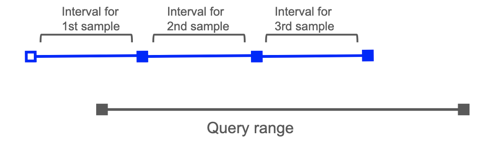

# OTEL delta temporality support

* **Owners:**
  * @fionaliao
  * Initial design started by @ArthurSens and @sh0rez
  * TODO: add others from delta wg

* **Implementation Status:** `Not implemented`

* **Related Issues and PRs:**
  * https://github.com/prometheus/prometheus/issues/12763

* **Other docs or links:**
  * [Original design doc](https://docs.google.com/document/d/15ujTAWK11xXP3D-EuqEWTsxWiAlbBQ5NSMloFyF93Ug/edit?tab=t.0)
  * [#prometheus-delta-dev](https://cloud-native.slack.com/archives/C08C6CMEUF6) - Slack channel for project
  * Additional context
    * [OpenTelemetry metrics: A guide to Delta vs. Cumulative temporality trade-offs](https://docs.google.com/document/d/1wpsix2VqEIZlgYDM3FJbfhkyFpMq1jNFrJgXgnoBWsU/edit?tab=t.0#heading=h.wwiu0da6ws68)
    * [Musings on delta temporality in Prometheus](https://docs.google.com/document/d/1vMtFKEnkxRiwkr0JvVOrUrNTogVvHlcEWaWgZIqsY7Q/edit?tab=t.0#heading=h.5sybau7waq2q)
    * [Chronosphere Delta Experience Report](https://docs.google.com/document/d/1L8jY5dK8-X3iEoljz2E2FZ9kV2AbCa77un3oHhariBc/edit?tab=t.0#heading=h.3gflt74cpc0y)

 This design doc proposes adding native delta support to Prometheus. This means storing delta metrics without transforming to cumulative, and having functions that behave appropriately for delta metrics.

## Why

Prometheus supports the ingestion of OTEL metrics via its OTLP endpoint. Counter-like OTEL metrics (e.g. histograms, sum) can have either [cumulative or delta temporality](https://opentelemetry.io/docs/specs/otel/metrics/data-model/#temporality). However, Prometheus only supports cumulative metrics, due to its pull-based approach to collecting metrics.

Therefore, delta metrics need to be converted to cumulative ones during ingestion. The OTLP endpoint in Prometheus has an [experimental feature to convert delta to cumulative](https://github.com/prometheus/prometheus/blob/9b4c8f6be28823c604aab50febcd32013aa4212c/docs/feature_flags.md?plain=1#L167[). Alternatively, users can run the [deltatocumulative processor](https://github.com/sh0rez/opentelemetry-collector-contrib/tree/main/processor/deltatocumulativeprocessor) in their OTEL pipeline before writing the metrics to Prometheus. 

Tthe cumulative code for storage and querying can be reused, and when querying, users don’t need to think about the temporality of the metrics - everything just works. However, there are downsides elaborated in the Pitfalls section below. 

Prometheus' goal of becoming the best OTEL metrics backend means we should support delta metrics properly. 

We propose to add native support for OTEL delta metrics (i.e. metrics ingested via the OTLP endpoint). Native support means storing delta metrics without transforming to cumulative, and having functions that behave appropriately for delta metrics.

### Delta datapoints

In the [OTEL spec](https://opentelemetry.io/docs/specs/otel/metrics/data-model/#temporality), like cumulative metrics, a datapoint for a delta metric has a `(start,end]` time window. However, the time windows of delta datapoints do not overlap.

The `end` timestamp is called  `TimeUnixNano` and is mandatory. The `start` timestamp is called `StartTimeUnixNano`. `StartTimeUnixNano` timestamp is optional, but recommended for better rate calculations and to detect gaps and overlaps in a stream.

### Characteristics of delta metrics

Sparse metrics are more common for delta than cumulative metrics. While delta datapoints can be emitted at a regular interval, in some cases (like the OTEL SDKs), datapoints are only emitted when there is a change (e.g. if tracking request count, only send a datapoint if the number of requests in the ingestion interval > 0). This can be beneficial for the metrics producer, reducing memory usage and network bandwidth. 

Further insights and discussions on delta metrics can be found in [Chronosphere Delta Experience Report](https://docs.google.com/document/d/1L8jY5dK8-X3iEoljz2E2FZ9kV2AbCa77un3oHhariBc/edit?tab=t.0#heading=h.3gflt74cpc0y), which describes Chronosphere's experience of adding functionality to ingest OTEL delta metrics and query them back with PromQL, and also [Musings on delta temporality in Prometheus](https://docs.google.com/document/d/1vMtFKEnkxRiwkr0JvVOrUrNTogVvHlcEWaWgZIqsY7Q/edit?tab=t.0#heading=h.5sybau7waq2q).

### Pitfalls of the current solution

#### Lack of out of order support

Delta to cumulative conversion requires adding up older delta samples values with the current delta value to get the current cumulative value, so deltas that arrive out of order cannot be added without rewriting newer samples that were already ingested.

As suggested in an [earlier delta doc](https://docs.google.com/document/d/1vMtFKEnkxRiwkr0JvVOrUrNTogVvHlcEWaWgZIqsY7Q/edit?tab=t.0#heading=h.5sybau7waq2q), a delay could be added to collect all the deltas within a certain time period before converting them to cumulative. This means a longer delay before metrics are queryable.

#### No added value to conversion

Cumulative metrics are resilient to data loss - if a sample is dropped, the next sample will still include the count from the previous sample. With delta metrics, if a sample is dropped, its data is just lost. Converting from delta to cumulative doesn’t improve resiliency as the data is already lost before it becomes a cumulative metric. 

Cumulative metrics are usually converted into deltas during querying (this is part of what `rate()` and `increase()` do), so converting deltas to cumulative is wasteful if they’re going to be converted back into deltas on read.

#### Conversion is stateful

Converting from delta to cumulative requires knowing previous values of the same series, so it’s stateful. Users may be unwilling to run stateful processes on the client-side (like the deltatocumulative processor). This is improved with doing the delta to cumulative conversion within the Prometheus OTLP endpoint, as that means there’s only one application that needs to maintain state (Prometheus is stateful anyway).

State becomes more complex in distributed cases - if there are multiple OTEL collectors running, or data being replicated to multiple Prometheus instances.

#### Values written aren’t the same as the values read

Cumulative metrics usually need to be wrapped in a `rate()` or `increase()` etc. call to get a useful result. However, it could be confusing when querying just the metric without any functions, the returned value is not the same as the ingested value.

#### Does not handle sparse metrics well
As mentioned in Background, sparse metrics are more common with delta. This can interact awkwardly with `rate()` - the `rate()` function in Prometheus does not work with only a single datapoint in the range, and assumes even spacing between samples.

## Goals

Goals and use cases for the solution as proposed in [How](#how):

* Allow OTEL delta metrics to be ingested via the OTLP endpoint and stored as-is
* Support for all OTEL metric types that can have delta temporality (sums, histograms, exponential histograms)
* Queries behave appropriately for delta metrics

### Audience

This document is for Prometheus server maintainers, PromQL maintainers, and Prometheus users interested in delta ingestion.

## Non-Goals

* Support for ingesting delta metrics via other means (e.g. remote-write)
* Support for converting OTEL non-monotonic sums to Prometheus counters (currently these are converted to Prometheus gauges)

These may come in later iterations of delta support, however.

## How

### Ingesting deltas

When an OTLP sample has its aggregation temporality set to delta, write its value at `TimeUnixNano`.

There is an effort towards adding CreatedTimestamp as a field for each sample ([PR](https://github.com/prometheus/prometheus/pull/16046/files)). This is for cumulative counters, but can be reused for deltas too. When this is completed, if `StartTimeUnixNano` is set for a delta counter, it should be stored in the CreatedTimestamp field of the sample.

CT-per-sample is not a blocker for deltas - before this is ready, `StartTimeUnixNano` will just be ignored.

### Chunks

For the initial implementation, reuse existing chunk encodings. 

Currently the counter reset behaviour for cumulative native histograms is to cut a new chunk if a counter reset is detected. If a value in a bucket drops, that counts as a counter reset. As delta samples don’t build on top of each other, there could be many false counter resets detected and cause unnecessary chunks to be cut. Therefore a new counter reset hint/header is required, to indicate the cumulative counter reset behaviour for chunk cutting should not apply.

### Distinguishing between delta and cumulative metrics

We need to be able to distinguish between delta and cumulative metrics. This would allow the query engine to apply different behaviour depending on the metric type. Users should also be able to see the temporality of a metric, which is useful for understanding the metric and for debugging.

Our suggestion is to build on top of the [proposal to add type and unit metadata labels to metrics](https://github.com/prometheus/proposals/pull/39/files). The `__type__` label will be extended with additional delta types for any counter-like types (e.g. `delta_counter`, `delta_histogram`). The original types (e.g. `counter`) will indicate cumulative temporality. (Note: type metadata might become native series information rather than labels; if that happens, we'd use that for indicating the delta types instead of labels.)

When ingesting a delta metric via the OTLP endpoint, the type will be added as a label.

A downside is that querying for all counter types or all delta series is less efficient - regex matchers like `__type__=~”(delta_counter|counter)”` or `__type__=~”delta_.*”` would have to be used. However, this does not seem like a particularly necessary use case to optimise for.

### Remote write

Remote write support is a non-goal for the initial implementation to reduce its scope. However, the current design ends up partially supporting ingesting delta metrics via remote write. This is because a label will be added to indicate the temporality of the metric and used during querying, and therefore can be added by remote write. However, there is currently no equivalent to StartTimeUnixNano per sample in remote write.

For the initial implementation, there should be a documented warning that deltas are not _properly_ supported with remote write yet.

### Scraping

No scraped metrics should have delta temporality as there is no additional benefit over cumulative in this case. To produce delta samples from scrapes, the application being scraped has to keep track of when a scrape is done and resetting the counter. If the scraped value fails to be written to storage, the application will not know about it and therefore cannot correctly calculate the delta for the next scrape.

Delta metrics will be filtered out from metrics being federated. If the current value of the delta series is exposed directly, data can be incorrectly collected if the ingestion interval is not the same as the scrape interval for the federate endpoint. The alternative is to convert the delta metric to a cumulative one, which has issues detailed above. 

### Querying deltas

*Note: this section likely needs the most discussion. I'm not 100% about the proposal because of issues guessing the start and end of series. The main alternatives can be found in [Querying deltas alternatives](#querying-deltas-alternatives), and a more detailed doc with additional context and options is [here](https://docs.google.com/document/d/15ujTAWK11xXP3D-EuqEWTsxWiAlbBQ5NSMloFyF93Ug/edit?tab=t.3zt1m2ezcl1s).*

`rate()` and `increase()` will be extended to support delta metrics too. If the `__type__` starts with `delta_`, execute delta-specific logic instead of the current cumulative logic. For consistenct, the delta-specific logic will keep the intention of the rate/increase functions - that is, estimate the rate/increase over the selected range given the samples in the range, extrapolating if the samples do not align with the start and end of the range.

`irate()` will also be extended to support delta metrics.

Having functions transparently handle the temporality simplifies the user experience - users do not need to know the temporality of a series for querying, and means queries don't need to be rewriten wehn migrating between cumulative and delta metrics.

`resets()` does not apply to delta metrics, however, so will return no results plus a warning in this case.

While the intention is to eventually use `rate()`/`increase()` etc. for both delta and cumulative metrics, initially experimental functions prefixed with `delta_` will be introduced behind a delta-support feature flag. This is to make it clear that these are experimental and the logic could change as we start seeing how they work in real-world scenarios. In the long run, we’d move the logic into `rate()` etc..

#### rate() calculation

TODO: write some code to make this clearer

In general: `sum of all sample values / (last sample ts - first sample start ts)) * range`. If the start time of the first sample is outside the range, truncate the first sample.

The current `rate()`/`increase()` implementations guess if the series starts or ends within the range, and if so, reduces the interval it extrapolates to. The guess is based on the gaps between gaps and the boundaries on the range.

With sparse delta series, a long gap to a boundary is not very meaningful. The series could be ongoing but if there are no new increments to the metric then there could be a long gap between ingested samples. 

We could just not try and predict the start/end of the series and assume the series continues to extend to beyond the samples in the range. However, not predicting the start and end of the series could inflate the rate/increase value, which can be especially problematic during rollouts when old series are replaced by new ones.

Assuming `rate()` only has information about the sample within the range, guessing the start and end of series is probably the least worst option - this will at least work in delta cases where the samples are continuously ingested. To predict if a series has started ended in the range, check if the timestamp of the last sample are within 1.1x of an interval between their respective boundaries (aligns with the cumulative check for start/end of a series).

As part of the implementation process, experiment with heuristics to try and improve this (e.g. if intervals between samples are regular and there are than X samples, assume the samples are continuously ingested and therefore a gap would mean the series ended). This would make the calculation more complex, however.

With CT-per-sample, we do not need to predict the start of the series, as if a sample is before the range start, it can't be within in the range at all.

#### Non-approximation

There may be cases where approximating the rate/increase over the selected range is unwanted for delta metrics. Approximation may work worse for deltas since we do not try and guess when series start and end.

Users may prefer "non-approximating" behaviour that just gives them the sum of the sample values within the range. This can be accomplished with `sum_over_time()`. Note that this does not accurately give them the increase within the range.

As an example:

* S1: StartTimeUnixNano: T0, TimeUnixNano: T2, Value: 5
* S2: StartTimeUnixNano: T2, TimeUnixNano: T4, Value: 1
* S3: StartTimeUnixNano: T4, TimeUnixNano: T6, Value: 9 

And  `sum_over_time()` was executed between T1 and T5.

As the samples are written at TimeUnixNano, only S1 and S2 are inside the query range. The total (aka “increase”)  of S1 and S2 would be 5 + 1 = 6. This is actually the increase between T0 (StartTimeUnixNano of S1) and T4 (TimeUnixNano of S2) rather than the increase between T1 and T5. In this case, the size of the requested range is the same as the actual range, but if the query was done between T1 and T4, the request and actual ranges would not match.

`sum_over_time()` does not work for cumulative metrics, so a warning should be returned in this case. One downside is that this could make migrating from delta to cumulative metrics harder, since `sum_over_time()` queries would need to be rewritten, and users wanting to use `sum_over_time()` will need to know the temporality of their metrics.

One possible solution would to have a function that does `sum_over_time()` for deltas and the cumulative equivalent too (this requires subtracting the latest sample before the start of the range with the last sample in the range). This is outside the scope of this design, however.

### Handling missing StartTimeUnixNano

StartTimeUnixNano is optional in the OTEL spec. To ensure compatibility with the OTEL spec, this case should be supported. Also note that before implementing CT-per-sample, every sample will be missing StartTimeUnixNano.

For functions that require an interval to operate (e.g. rate()/increase()), assume the spacing between samples is the ingestion interval when StartTimeUnixNano is missing. 

## Alternatives

### Ingesting deltas alternatives

#### Inject zeroes for StartTimeUnixNano

[CreatedAt timestamps can be injected as 0-valued samples](https://prometheus.io/docs/prometheus/latest/feature_flags/#created-timestamps-zero-injection). Similar could be done for StartTimeUnixNano. 

CT-per-sample is a better solution overall as it links the start timestamp with the sample. It makes it easier to detect overlaps between delta samples (indicative of multiple producers sending samples for the same series), and help with more accurate rate calculations.

If CT-per-sample takes too long, this could be a temporary solution.

#### Treat as gauge
To avoid introducing a new type, deltas could be represented as gauges instead and the start time ignored.

This could be confusing as gauges are usually used for sampled data (for example, in OTEL: "Gauges do not provide an aggregation semantic, instead “last sample value” is used when performing operations like temporal alignment or adjusting resolution.”) rather than data that should be summed/rated over time. 

#### Treat as “mini-cumulative”
Deltas can be thought of as cumulative counters that reset after every sample. So it is technically possible to ingest as cumulative and on querying just use the cumulative functions. 

This requires CT-per-sample to be implemented. Just zero-injection of StartTimeUnixNano would not work all the time. If there are samples at consecutive intervals, the StartTimeUnixNano for a sample would be the same as the TimeUnixNano for the preceding sample and cannot be injected.

Functions will not take into account delta-specific characteristics. The OTEL SDKs only emit datapoints when there is a change in the interval. rate() assumes samples in a range are equally spaced to figure out how much to extrapolate, which is less likely to be true for delta samples.

This also does not work for samples missing StartTimeUnixNano.

#### Convert to rate on ingest
Convert delta metrics to per-second rate by dividing the sample value with (`TimeUnixName` - `StartTimeUnixNano`) on ingest, and also append `:rate` to the end of the metric name (e.g. `http_server_request_duration_seconds` -> `http_server_request_duration_seconds:rate`). So the metric ends up looking like a normal Prometheus counter that was rated with a recording rule.

The difference is that there is no interval information in the metric name (like :rate1m) as there is no guarantee that the interval from sample to sample stays constant.

To averages rates over more than the original collection interval, a new time-weighted average function is required to accommdate cases like the collection interval changing and having a query range which isn't a multiple of the interval.

This would also require zero timestamp injection or CT-per-sample for better rate calculations.

Users might want to convert back to original values (e.g. to sum the original values over time). It can be difficult to reconstruct the original value if the start timestamp is far away (as there are probably limits to how far we could look back). Having CT-per-sample would help in this case, as both the StartTimeUnixNano and the TimeUnixNano would be within the sample. However, in this case it is trivial to convert between the rated and unrated count, so there is no additional benefit of storing as the calculated rate. In that case, we should prefer to store the original value as that would cause less confusion to users who look at the stored values.

This also does not work for samples missing StartTimeUnixNano.

### Distinguishing between delta and cumulative metrics alternatives

#### New `__temporality__` label

A new `__temporality__` label could be added instead.

However, not all metric types should have a temporality (e.g. gauge). Having `delta_` as part of the type label enforces that only specific metric types can have temporality. Otherwise, additional label error checking would need to be done to make sure `__temporality__` is only added to specific types.

#### Metric naming convention

Have a convention for naming metrics e.g. appending `_delta_counter` to a metric name. This could make the temporality more obvious at query time. However, assuming the type and unit metadata proposal is implemented, having the temporality as part of a metadata label would be more consistent than having it in the metric name.

### Querying deltas alternatives

#### Lookahead and lookbehind of range

The reason why `increase()`/`rate()` need extrapolation to cover the entire range is that they’re constrained to only look at the samples within the range. This is a problem for both cumulative and delta metrics.

To work out the increase more accurately, they would also have to look at the sample before and the sample after the range to see if there are samples that partially overlap with the range - in that case the partial overlaps should be added to the increase.

This could be a new function, or changing the `rate()` function (it could be dangerous to adjust `rate()`/`increase()` though as they’re so widely used that users may be dependent on their current behaviour even if they are “less accurate”).

With deltas, we don’t need to lookbehind if we had CT-per-sample, only lookahead.

This would be a good long-term proposal for deltas (and cumulative metrics).

#### Do sum_over_time() / range for delta `rate()` implementation

Instead of trying to approximate the rate over the interval, just sum all the samples in the range and divide by the range for `rate()`.

For cumulative metrics, just taking the samples in the range and not approximating to cover the whole range is a bad approach. In the cumulative case, this would mean just taking the difference between the first and last samples and dividing by the range.  As the first and last samples are unlikely to perfectly align with the start and end of the range, taking the difference between the two is likely to be an underestimation of the increase for the range. 

For delta metrics, this is less likely to be an underestimation. Non-approximation would mean something different than in the cumulative case - summing all the samples together. It's less likely to be an underestimation because the start time of the first sample could be before the start of the query range. So the total range of the selected samples could be similar to the query range.

Below is an image to demonstrate - the filled in blue squares are the samples within the range, with the lines between the interval for which the sample data was collected. The unfilled blue squad is the start time for the first sample in the range, which is before the start time of the query range, and the total range of the samples is similar to the query range, just offset.

As noted in [Non-approximation](#non-approximation), the actual range covered by the sum could still be different from the query range in the delta case. For the ranges to match, the query range needs to be a multiple of the collection interval, which Prometheus does not enforce. Also, this finds the rate between the start time of the first sample and the end time of the last sample, which won't always match the start and end times of the query.

For users wanting this behaviour instead of the suggested one (approximating the rate/increase over the selected range), it is still possible do with (`sum_over_time(<delta metric>)` / `<range>`).

Having `rate()`/`increase()`) do different things for cumulative and delta metrics can be confusing (e.g. with deltas and integer samples, you'd always get an integer value if you use `sum_over_time()`, but the same wouldn't be true for cumulative metrics with the current `increase()` behaviour). 

If we were to add behaviour to do the cumulative version of "sum_over_time", that would likely be in a different function. And then you'd have different functions to do non-approximation for delta and cumulative metrics, which again causes confusion.

If we went for this approach first, but then updated `rate() to lookahead and lookbehind in the long term, users depending on the "non-extrapolation" could be affected.

#### Convert to cumulative on query

Delta to cumulative conversion at query time doesn’t have the same out of order issues as conversion at ingest. When a query is executed, it uses a fixed snapshot of data. The order the data was ingested does not matter, the cumulative values are correctly calculated by processing the samples in timestamp-order. 

No function modification needed - all cumulative functions will work for samples ingested as deltas.

However, it can be confusing for users that the delta samples they write are transformed into cumulative samples with different values during querying. The sparseness of delta metrics also do not work well with the current `rate()` and `increase()` functions.

## Known unknowns

### Native histograms performance

To work out the delta for all the cumulative native histograms in an interval, the first sample is subtracted from the last and then adjusted for counter resets within all the samples. Counter resets are detected at ingestion time when possible. This means the query engine does not have to read all buckets from all samples to calculate the result. The same is not true for delta metrics - as each sample is independent, to get the delta between the start and end of the interval, all of the buckets in all of the samples need to be summed, which is less efficient at query time.

## Action Plan

The tasks to do in order to migrate to the new idea.

TODO: break down further

- [ ] Implement type and metadata proposal
- [ ] Add delta ingestion + `delta_` functions behind new feature flag
- [ ] Merge `delta_` functions with cumulative equivalent 
