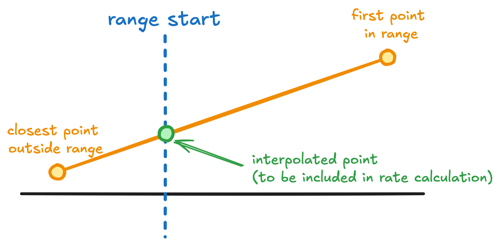

# OTEL delta temporality support

* **Owners:**
  * @fionaliao

* **Contributors:**  
  * Initial design started by @ArthurSens and @sh0rez
  * Delta WG contributors: @ArthurSens, @enisoc and @subvocal

* **Implementation Status:** `Partially implemented`

* **Related Issues and PRs:**
  * https://github.com/prometheus/prometheus/issues/12763

* **Other docs or links:**
  * [Original design doc](https://docs.google.com/document/d/15ujTAWK11xXP3D-EuqEWTsxWiAlbBQ5NSMloFyF93Ug/edit?tab=t.0)
  * [#prometheus-delta-dev](https://cloud-native.slack.com/archives/C08C6CMEUF6) - Slack channel for project
  * [OpenTelemetry metrics: A guide to Delta vs. Cumulative temporality trade-offs](https://docs.google.com/document/d/1wpsix2VqEIZlgYDM3FJbfhkyFpMq1jNFrJgXgnoBWsU/edit?tab=t.0#heading=h.wwiu0da6ws68)
  * [Musings on delta temporality in Prometheus](https://docs.google.com/document/d/1vMtFKEnkxRiwkr0JvVOrUrNTogVvHlcEWaWgZIqsY7Q/edit?tab=t.0#heading=h.5sybau7waq2q)
  * [Chronosphere Delta Experience Report](https://docs.google.com/document/d/1L8jY5dK8-X3iEoljz2E2FZ9kV2AbCa77un3oHhariBc/edit?tab=t.0#heading=h.3gflt74cpc0y)

A proposal for adding experimental support for OTEL delta temporality metrics in Prometheus, allowing them be ingested, stored and queried directly.

## Why

Prometheus supports the ingestion of OTEL metrics via its OTLP endpoint. Counter-like OTEL metrics (e.g. histograms, sum) can have either [cumulative or delta temporality](https://opentelemetry.io/docs/specs/otel/metrics/data-model/#temporality). However, Prometheus only supports cumulative metrics, due to its pull-based approach to collecting metrics.

Therefore, delta metrics need to be converted to cumulative ones during ingestion. The OTLP endpoint in Prometheus has an [experimental feature to convert delta to cumulative](https://github.com/prometheus/prometheus/blob/9b4c8f6be28823c604aab50febcd32013aa4212c/docs/feature_flags.md?plain=1#L167[). Alternatively, users can run the [deltatocumulative processor](https://github.com/sh0rez/opentelemetry-collector-contrib/tree/main/processor/deltatocumulativeprocessor) in their OTEL pipeline before writing the metrics to Prometheus. 

The cumulative code for storage and querying can be reused, and when querying, users don’t need to think about the temporality of the metrics - everything just works. However, there are downsides elaborated in the [Pitfalls section](#pitfalls-of-the-current-solution) below. 

Prometheus' goal of becoming the best OTEL metrics backend means it should improve its support for delta metrics, allowing them to be ingested and stored without being transformed into cumulative.

We propose some initial steps for delta support in this document. These delta features will be experimental and opt-in, allowing us to gather feedback and gain practical experience with deltas before deciding on future steps.

### OTEL delta datapoints

In the [OTEL spec](https://opentelemetry.io/docs/specs/otel/metrics/data-model/#temporality), like cumulative metrics, a datapoint for a delta metric has a `(start,end]` time window. However, the time windows of delta datapoints do not overlap.

The `end` timestamp is called  `TimeUnixNano` and is mandatory. The `start` timestamp is called `StartTimeUnixNano`. `StartTimeUnixNano` timestamp is optional, but recommended for better rate calculations and to detect gaps and overlaps in a stream.

### Characteristics of delta metrics

Sparse metrics are more common for delta than cumulative metrics. While delta datapoints can be emitted at a regular interval, in some cases (like the OTEL SDKs), datapoints are only emitted when there is a change (e.g. if tracking request count, only send a datapoint if the number of requests in the ingestion interval > 0). This can be beneficial for the metrics producer, reducing memory usage and network bandwidth.

Further insights and discussions on delta metrics can be found in [Chronosphere Delta Experience Report](https://docs.google.com/document/d/1L8jY5dK8-X3iEoljz2E2FZ9kV2AbCa77un3oHhariBc/edit?tab=t.0#heading=h.3gflt74cpc0y), which describes Chronosphere's experience of adding functionality to ingest OTEL delta metrics and query them back with PromQL, and also [Musings on delta temporality in Prometheus](https://docs.google.com/document/d/1vMtFKEnkxRiwkr0JvVOrUrNTogVvHlcEWaWgZIqsY7Q/edit?tab=t.0#heading=h.5sybau7waq2q).

#### Alignment

The Prometheus scrape collection model deliberately gives you "unaligned" sampling, i.e. targets with the same scrape interval are still scraped at different phases (not all at the full minute, but hashed over the minute). 

The usual case for delta metrics is to collect increments over the collection interval (e.g. 1m), and then send out the collected increments at the full minute. This isn't true in all cases though, for example, the StatsD client libraries emits a delta every time an event happens rather than aggregating, producing unaligned samples (though the StatsD daemon does then aggregate to an aligned interval).

### Pitfalls of the current solution

#### Lack of out of order support

Delta to cumulative conversion requires adding up older delta samples values with the current delta value to get the current cumulative value, so deltas that arrive out of order cannot be added without rewriting newer samples that were already ingested.

As suggested in an [earlier delta doc](https://docs.google.com/document/d/1vMtFKEnkxRiwkr0JvVOrUrNTogVvHlcEWaWgZIqsY7Q/edit?tab=t.0#heading=h.5sybau7waq2q), a delay could be added to collect all the deltas within a certain time period before converting them to cumulative. This means a longer delay before metrics are queryable.

#### No added value to conversion

Cumulative metrics are resilient to data loss - if a sample is dropped, the next sample will still include the count from the previous sample. With delta metrics, if a sample is dropped, its data is just lost. Converting from delta to cumulative doesn’t improve resiliency as the data is already lost before it becomes a cumulative metric. 

Cumulative metrics are usually converted into deltas during querying (this is part of what `rate()` and `increase()` do), so converting deltas to cumulative is wasteful if they’re going to be converted back into deltas on read.

#### Conversion is stateful

Converting from delta to cumulative requires knowing previous values of the same series, so it’s stateful. Users may be unwilling to run stateful processes on the client-side (like the deltatocumulative processor). This is improved with doing the delta to cumulative conversion within the Prometheus OTLP endpoint, as that means there’s only one application that needs to maintain state (Prometheus is stateful anyway).

State becomes more complex in distributed cases - if there are multiple OTEL collectors running, or data being replicated to multiple Prometheus instances.

#### Values written aren’t the same as the values read

Cumulative metrics usually need to be wrapped in a `rate()` or `increase()` etc. call to get a useful result. However, it could be confusing that when querying just the metric without any functions, the returned value is not the same as the ingested value.

#### Poor sparse metrics handling

Sparse metrics are more common with deltas. This can interact awkwardly with `rate()` - the `rate()` function in Prometheus does not work with only a single datapoint in the range, and assumes even spacing between samples.

## Goals

Goals and use cases for the solution as proposed in [How](#how):

* Allow OTEL delta metrics to be ingested via the OTLP endpoint and stored directly.
* Support for all OTEL metric types that can have delta temporality (sums, histograms, exponential histograms).
* Allow delta metrics to be distinguished from cumulative metrics.
* Allow the query engine to flag warnings when a cumulative function is used on deltas.

### Audience

This document is for Prometheus server maintainers, PromQL maintainers, and Prometheus users interested in delta ingestion.

## Non-Goals

* Support for ingesting delta metrics via other, non-OTLP means (e.g. replacing push gateway).
* Advanced querying support for deltas (e.g. function overloading for `rate()`). Given that delta support is new and advanced querying also depends on other experimental features, the best approach - or whether we should even extend querying - is currently uncertain. However, this document does explore some possible options.

These may come in later iterations of delta support.

## How

### Ingesting deltas

When an OTLP sample has its aggregation temporality set to delta, write its value at `TimeUnixNano`.

For the initial implementation, ignore `StartTimeUnixNano`. To ensure compatibility with the OTEL spec, this case should ideally be supported. A way to preserve `StartTimeUnixNano` is described in the potential future extension, [CT-per-sample](#ct-per-sample).

### Chunks

For the initial implementation, reuse existing chunk encodings.

Delta counters will use the standard XOR chunks for float samples.

Delta histograms will use native histogram chunks with the `GaugeType` counter reset hint/header. The counter reset behaviour for cumulative native histograms is to cut a new chunk if a counter reset is detected. A (bucket or total) count drop is detected as a counter reset. As delta samples don’t build on top of each other, there could be many false counter resets detected and cause unnecessary chunks to be cut. Additionally, counter histogram chunks have the invariant that no count ever goes down baked into their implementation.  `GaugeType` allows counts to go up and down, and does not cut new chunks on counter resets.

### Delta metric type

It is useful to be able to distinguish between delta and cumulative metrics. This would allow users to understand what the raw data represents and what functions are appropiate to use. Additionally, this could allow the query engine or UIs displaying Prometheus data apply different behaviour depending on the metric type to provide meaningful output.

As per [Prometheus documentation](https://prometheus.io/docs/concepts/metric_types/), "The Prometheus server does not yet make use of the type information and flattens all data into untyped time series". Recently however, there has been [an accepted Prometheus proposal (PROM-39)](https://github.com/prometheus/proposals/pull/39) to add experimental support type and unit metadata as labels to series, allowing more persistent and structured storage of metadata than was previously available. This means there is potential to build features on top of the typing in the future.

We propose to add two options as feature flags for ingesting deltas:

1. `--enable-feature=otlp-delta-as-gauge-ingestion`: Ingests OTLP deltas as gauges.

2. `--enable-feature=otlp-native-delta-ingestion`: Ingests OTLP deltas with a new `__temporality__` label to explicitly mark metrics as delta or cumulative, similar to how the new type and unit metadata labels are being added to series.

We would like to initially offer both options as they have different tradeoffs. The gauge option is more stable, since it's a pre-exisiting type and has been used for delta-like use cases in Prometheus already. The temporality label option is very experimental and dependent on other experimental features, but it has the potential to offer a better user experience in the long run as it allows more precise differentiation.

Below we explore the pros and cons of each option in more detail.

#### Treat as gauge

Deltas could be treated as Prometheus gauges. A gauge is a metric that can ["arbitrarily go up and down"](https://prometheus.io/docs/concepts/metric_types/#gauge), meaning it's compatible with delta data.

When ingesting, the metric metadata type will be set to `gauge` / `gaugehistogram`. If type and unit metadata labels is enabled, `__type__="gauge"` / `__type__="gaugehistogram"` will be added as a label.

**Pros**
* Simplicity - this approach leverages an existing Prometheus metric type, reducing the changes to the core Prometheus data model.
* Prometheus already implicitly uses gauges to represent deltas. For example, `increase()` outputs the delta count of a series over an specified interval. While the output type is not explicitly defined, it's considered a gauge.
* Non-monotonic cumulative sums in OTEL are already ingested as Prometheus gauges, meaning there is precedent for counter-like OTEL metrics being converted to Prometheus gauge types.

**Cons**
* Gauge has different meanings in Prometheus and OTEL. In Prometheus, it's just a value that can go up and down, while in OTEL it's the "last-sampled event for a given time window". While it technically makes sense to represent an OTEL delta counter as a Prometheus gauge, this could be a point of confusion for OTEL users who see their counter being mapped to a Prometheus gauge rather than a Prometheus counter. There could also be uncertainty for the user on whether the metric was accidentally instrumented as a gauge or whether it was converted from a delta counter to a gauge.
* Gauges are usually aggregated in time by averaging or taking the last value, while deltas are usually summed. Treating both as a single type would mean there wouldn't be an appropriate default aggregation for gauges. Having a predictable aggregation by type is useful for downsampling, or applications that try to automatically display meaningful graphs for metrics (e.g. the [Grafana Explore Metrics](https://github.com/grafana/grafana/blob/main/docs/sources/explore/_index.md) feature).
* The original delta information is lost upon conversion. If the resulting Prometheus gauge metric is converted back into an OTEL metric, it would be converted into a gauge rather than a delta metric. While there's no proven need for roundtrippable deltas, maintaining OTEL interoperability helps Prometheus be a good citizen in the OpenTelemetry ecosystem.

#### Introduce `__temporality__` label

This option extends the metadata labels proposal (PROM-39). An additional `__temporality__` metadata label will be added. The value of this label would be either `delta` or `cumulative`. If the temporality label is missing, the temporality should be assumed to be cumulative.

`--enable-feature=otlp-native-delta-ingestion` will only be allowed to be enabled if `--enable-feature=type-and-unit-labels` is also enabled, as it depends heavily on the that feature.

When ingesting a delta metric via the OTLP endpoint, the metric type is set to `counter` / `histogram` (and thus the `__type__` label will be `counter` / `histogram`), and the `__temporality__="delta"` label will be added. As mentioned in the [Chunks](#chunks) section, `GaugeType` should still be the counter reset hint/header.

Cumulative metrics ingested via the OTLP endpoint will also have a `__temporality__="cumulative"` label added.

**Pros**
* Clear distinction between delta metrics and gauge metrics.
* Closer match with the OTEL model - in OTEL, counter-like types sum over events over time, with temporality being an property of the type. This is mirrored by having separate `__type__` and `__temporality__` labels in Prometheus.
* When instrumenting with the OTEL SDK, the type needs to be explicitly defined for a metric but not its temporality. Additionally, the temporality of metrics could change in the metric processing pipeline (for example, using the deltatocumulative or cumulativetodelta processors). As a result, users may know the type of a metric but be unaware of its temporality at query time. If different query functions are required for delta versus cumulative metrics, it is difficult to know which one to use. By representing both type and temporality as metadata, there is the potential for functions like `rate()` to be overloaded or adapted to handle any counter-like metric correctly, regardless of its temporality. (See [Function overloading](#function-overloading) for more discussion.)

**Cons**
* Dependent the `__type__` and `__unit__` feature, which is itself experimental and requires more testing and usages for refinement.
* Introduces additional complexity to the Prometheus data model.
* Systems or scripts that handle Prometheus metrics may be unware of the new `__temporality__` label and could incorrectly treat all counter-like metrics as cumulative, resulting in hard-to-notice calculation errors.
* In this initial proposal, metrics with `__temporality__="delta"` will essentially be queried in the same way as Prometheus gauges - both gauges and deltas can be aggregated with `sum_over_time()`, so it may be confusing to have two different "types" with the same querying patterns.

### Metric names

OTEL metric names are normalised when translated to Prometheus by default ([code](https://github.com/prometheus/otlptranslator/blob/94f535e0c5880f8902ab8c7f13e572cfdcf2f18e/metric_namer.go#L157)). This includes adding suffixes in some cases. For example, OTEL metrics converted into Prometheus counters (i.e. monotonic cumulative sums in OTEL) have the `__total` suffix added to the metric name, while gauges do not.

The `_total` suffix will not be added to OTEL deltas, ingested as either counters with temporality label or gauges. The `_total` suffix is used to help users figure out whether a metric is a counter. As deltas depend on type and unit metadata labels being added, especially in the `--enable-feature=otlp-native-delta-ingestion` case, the `__type__` label will be able to provide the distinction and the suffix is unnecessary.

This means switching between cumulative and delta temporality can result in metric names changing, affecting dashboards and alerts. However, the current proposal requires different functions for querying delta and cumulative counters anyway.

### Monoticity 

OTEL sums have a [monoticity property](https://opentelemetry.io/docs/specs/otel/metrics/supplementary-guidelines/#monotonicity-property), which indicates if the sum can only increase or if it can increase and decrease. Monotonic cumulative sums are mapped to Prometheus counters. Non-monotonic cumulative sums are mapped to Prometheus gauges, since Prometheus does not support counters that can decrease. This is because any drop in a Prometheus counter is assumed to be a counter reset.

It is not necessary to detect counter resets for delta metrics - to get the increase over an interval, you can just sum the values over that interval. Therefore, for the  `--enable-feature=otlp-native-delta-ingestion` option, where OTEL deltas are converted into Prometheus counters (with `__temporality__` label), non-monotonic delta sums will also be converted in the same way (with `__type__="counter"` and `__temporality__="delta"`).

This ensures StatsD counters can be ingested as Prometheus counters. [The StatsD receiver sets counters as non monotonic by default](https://github.com/open-telemetry/opentelemetry-collector-contrib/blob/main/receiver/statsdreceiver/README.md). Note there has been some debate on whether this should be the case or not ([issue 1](https://github.com/open-telemetry/opentelemetry-collector-contrib/issues/1789), [issue 2](https://github.com/open-telemetry/opentelemetry-collector-contrib/issues/14956)).

Consequences include not being to convert delta counters in Prometheus into their cumulative counterparts (e.g. for any possible future querying extensions for deltas). Also, as monoticity information is lost, if the metrics are later exported back into the OTEL format, all deltas will have to be assumed to be non-monotonic.

### Scraping

No scraped metrics should have delta temporality as there is no additional benefit over cumulative in this case. To produce delta samples from scrapes, the application being scraped has to keep track of when a scrape is done and resetting the counter. If the scraped value fails to be written to storage, the application will not know about it and therefore cannot correctly calculate the delta for the next scrape.

### Federation

Federating delta series directly could be usable if there is a constant and known collection interval for the delta series, and the metrics are scraped at least as often as the collection interval. This is not the case for all deltas and the scrape interval cannot be enforced. Therefore we will add a warning to the delta documentation explaining the issue with federating delta metrics, and provide a scrape config for ignoring deltas if the `__temporality__="delta"` label is set. If deltas are converted to gauges, there would not be a way to distinguish deltas from regular gauges so we cannot provide a scrape config.

### Remote write ingestion

Remote write support is a non-goal for this initial delta proposal to reduce its scope. However, the current design ends up supporting ingesting delta metrics via remote write. This is because a label will be added to indicate the temporality of the metric and used during querying, and therefore can be added manually added to metrics before being sent by remote write.

### Prometheus metric metadata

Prometheus has metric metadata as part of its metric model, which include the type of a metric. For this initial proposal, this will not be modified. Temporality will not be added as an additional metadata field, and will only be able to be set via the `__temporality__` label on a series.

### Prometheus OTEL receivers

Once deltas are ingested into Prometheus, they can be converted back into OTEL metrics by the prometheusreceiver (scrape) and [prometheusremotewritereceiver](https://github.com/open-telemetry/opentelemetry-collector-contrib/tree/main/receiver/prometheusremotewritereceiver) (push).

The prometheusreceiver has the same issue described in [Scraping](#scraping) regarding possibly misaligned scrape vs delta ingestion intervals.

If we do not modify prometheusremotewritereceiver, then `--enable-feature=otlp-native-delta-ingestion` will set the metric metadata type to counter. The receiver will currently assume it's a cumulative counter ([code](https://github.com/open-telemetry/opentelemetry-collector-contrib/blob/7592debad2e93652412f2cd9eb299e9ac8d169f3/receiver/prometheusremotewritereceiver/receiver.go#L347-L351)), which is incorrect. If we gain more confience that the `__temporality__` label is the correct approach, the receiver should be updated to translate counters with `__temporality__="delta"` to OTEL sums with delta temporality. For now, we will recommend that delta metrics should be dropped before reaching the  receiver, and provide a remote write relabel config for doing so.

### Querying deltas

For this initial proposal, existing functions will be used for querying deltas.

`rate()` and `increase()` will not work, since they assume cumulative metrics. Instead, the `sum_over_time()` function can be used to get the increase in the range, and `sum_over_time(metric[<range>]) / <range>` can be used for the rate. `metric / interval` can also be used to calculate a rate if the ingestion interval is known.

Having different functions for delta and cumulative counters mean that if the temporality of a metric changes, queries will have to be updated.

Possible improvements to rate/increase calculations and user experience can be found in [Rate calculation extensions](#rate-calculation-extensions) and [Function overloading](#function-overloading).

Note: With [left-open range selectors](https://prometheus.io/docs/prometheus/3.5/migration/#range-selectors-and-lookback-exclude-samples-coinciding-with-the-left-boundary) introduced in Prometheus 3.0, queries such as `sum_over_time(metric[<interval])` will exclude the sample at the left boundary. This is a fortunate usability improvement for querying deltas - with Prometheus 2, a `1m` interval actually covered `1m1s`, which could lead to double counting samples in consecutive steps and inflated sums; to get the actual value within `1m`, the awkward `59s999ms` had to be used instead.

#### Querying range misalignment

With `sum_over_time()`, the actual range covered by the sum could be different from the query range. For the ranges to match, the query range needs to be a multiple of the collection interval, which Prometheus does not enforce. Additionally, this finds the rate between the start time of the first sample and the end time of the last sample, which won't always match the start and end times of the query. This differs for `rate()` and `increase()` for cumulative metrics, which calculates the rate/increase specifically for the selected range.

**Example 1**

* S1: StartTimeUnixNano: T0, TimeUnixNano: T2, Value: 5
* S2: StartTimeUnixNano: T2, TimeUnixNano: T4, Value: 1
* S3: StartTimeUnixNano: T4, TimeUnixNano: T6, Value: 9 

And  `sum_over_time()` was executed between T1 and T5.

As the samples are written at TimeUnixNano, only S1 and S2 are inside the query range. The total (aka “increase”)  of S1 and S2 would be 5 + 1 = 6. This is actually the increase between T0 (StartTimeUnixNano of S1) and T4 (TimeUnixNano of S2) rather than the increase between T1 and T5. In this case, the size of the requested range is the same as the actual range, but if the query was done between T1 and T4, the request and actual ranges would not match.

**Example 2**

* S1: StartTimeUnixNano: T0, TimeUnixNano: T5, Value: 10

`sum_over_time()` between T0 and T5 will get 10. Divided by 5 for the rate results in 2.

However, if you only query between T4 and T5, the rate would be 10/1 = 1 , and queries between earlier times (T0-T1, T1-T2 etc.) will have a rate of zero.

Whether this is a problem or not is subjective. Users may prefer this behaviour, as unlike the cumulative `rate()`/`increase()`, it does not attempt to extrapolate. This makes the results easier to reason about and directly reflects the ingested data. The [Chronosphere user experience report](https://docs.google.com/document/d/1L8jY5dK8-X3iEoljz2E2FZ9kV2AbCa77un3oHhariBc/edit?tab=t.0) supports this: "user feedback indicated [`sum_over_time()`] felt much more natural and trustworthy when working with deltas" compared to converting deltas to cumulative and having `rate()`/`increase()` apply its usual extrapolation.

For some delta systems like StatsD, each sample represents an value that occurs at a specific moment in time, rather than being aggregated over a window. In these cases, each delta sample can be viewed as representing a infinitesimally small interval around its timestamp. This means taking into account of all the samples in the range, without extrapolation or interpolation, is an good representation of increase in the range - there are no samples in the range that only partially contribute to the range, and there are no samples out of the range which contribute to the increase in the range at all. For our initial implementation, the collection interval is ignored (i.e. `StartTimeUnixNano` is dropped), so all deltas could be viewed in this way.

#### Function warnings

To help users use the correct functions, warnings will be added if the metric type/temporality does not match the types that should be used with the function.

* Cumulative counter-specific functions (`rate()`, `increase()`, `irate()` and `resets()`)  will warn if `__type__="gauge"` or `__temporality__="delta"`.
* `sum_over_time()` will warn if  `type="counter"` with no `__temporality__` label (implies cumulative counter), or if `__temporality__="cumulative"`.
There are also additional functions that should only be used with Prometheus gauges (e.g. `delta()`) rather than cumulative counters. Out of scope of delta vs cumulative though.

### Summary

This initial approach enables Prometheus to support OTEL delta metrics in a careful manner by relying on existing concepts like labels and reusing existing functions with minimal changes, and also provides a foundation for potentially building more advanced delta features in the future.

## Potential future extensions

Potential extensions, likely requiring dedicated proposals.

### CT-per-sample

[CreatedTimestamp (PROM-29)](https://github.com/prometheus/proposals/blob/main/proposals/0029-created-timestamp.md) records when a time series was created or last reset, therefore allowing more accurate rate or increase calculations. This is similar to the `StartTimeUnixNano` field in OTEL metrics.

There is an effort towards adding CreatedTimestamp as a field for each sample ([PR](https://github.com/prometheus/prometheus/pull/16046/files)). This is for cumulative counters, but can be reused for deltas too. When this is completed, if `StartTimeUnixNano` is set for a delta counter, it should be stored in the CreatedTimestamp field of the sample.

CT-per-sample is not a blocker for deltas - before this is ready, `StartTimeUnixNano` will just be ignored.

Having CT-per-sample can improve the `rate()` calculation - the ingestion interval for each sample will be directly available, rather than having to guess the interval based on gaps. It also means a single sample in the range can result in a result from `rate()` as the range will effectively have an additional point at `StartTimeUnixNano`. 

There are unknowns over the performance and storage of essentially doubling the number of samples with this approach.

### Inject zeroes for StartTimeUnixNano

[CreatedAt timestamps can be injected as 0-valued samples](https://prometheus.io/docs/prometheus/latest/feature_flags/#created-timestamps-zero-injection). Similar could be done for StartTimeUnixNano. 

CT-per-sample is a better solution overall as it links the start timestamp with the sample. It makes it easier to detect overlaps between delta samples (indicative of multiple producers sending samples for the same series), and help with more accurate rate calculations.

If CT-per-sample takes too long, this could be a temporary solution.

It's possible for the StartTimeUnixNano of a sample to be the same as the TimeUnixNano of the preceding sample; care would need to be taken to not overwrite the non-zero sample value.

### Rate calculation extensions

[Querying deltas](#querying-deltas) outlined the caveats of using `sum_over_time(...[<interval>]) / <interval>` to calculate the increase for delta metrics. In this section, we explore possible alternative implementations for delta metrics. 

This section assumes knowledge of [Extended range selectors semantics proposal](https://github.com/prometheus/proposals/blob/main/proposals/2025-04-04_extended-range-selectors-semantics.md) which introduces the `smoothed` and `anchored` modifers to range selectors, in particular for `rate()` and `increase()` for cumulative counters.

##### Lookahead and lookbehind of range

The reason why `increase()`/`rate()` need extrapolation for cumulative counters is to cover the entire range is that they’re constrained to only look at the samples within the range. This is a problem for both cumulative and delta metrics.

To work out the increase more accurately, the functions would also have to look at the sample before and the sample after the range to see if there are samples that partially overlap with the range - in that case the partial overlaps should be added to the increase. 

The `smoothed` modifer in the extended range selectors proposal does this for cumulative counters - looking at the points before and after the range to more accurately calculate the rate/increase. We could implement something similar with deltas, though we cannot naively use the propossed smoothed behaviour for deltas. 

The `smoothed` proposal works by injecting points at the edges of the range. For the start boundary, the injected point will have its value worked out by linearly interpolating between the closest point before the range start and the first point inside the range.

That value would be nonesensical for deltas, as the values for delta samples are independent. Additionally, for deltas, to work out the increase, we add all the values up in the range (with some adjustments) vs in the cumulative case where you subtract the first point in the range from the last point. So it makes sense the smoothing behaviour would be different.

In the delta case, the adjustment to samples in the range used for the rate calculation would be to work out the proportion of the first sample within the range and update its value. We would use the assumption that the start timestamp for the first sample is equal the the timestamp of the previous sample, and then use the formula `inside value * (inside ts - range start ts) / (inside ts - outside ts)` to adjust the first sample (aka the `inside value`). 

#### Similar logic to cumulative case

For cumulative counters, `increase()` works by subtracting the first sample from the last sample in the range, adjusting for counter resets, and then extrapolating to estimate the increase for the entire range. The extrapolation is required as the first and last samples are unlikely to perfectly align with the start and end of the range, and therefore just taking the difference between the two is likely to be an underestimation of the increase for the range. `rate()` divides the result of `increase()` by the range. This gives an estimate of the increase or rate of the selected range.

For consistency, we could emulate that for deltas. 

First sum all sample values in the range, with the first sample’s value only partially included if it's not completely within the query range. To estimate the proporation of the first sample within the range, assume its interval is the average interval betweens all samples within the range. If the last sample does not align with the end of the time range, the sum should be extrapolated to cover the range until the end boundary. 

The cumulative `rate()`/`increase()` implementations guess if the series starts or ends within the range, and if so, reduces the interval it extrapolates to. The guess is based on the gaps between gaps and the boundaries on the range. With sparse delta series, a long gap to a boundary is not very meaningful. The series could be ongoing but if there are no new increments to the metric then there could be a long gap between ingested samples.

For the delta end boundary extrapolation, we could just not try and predict the end of the series and assume the series continues to extend to beyond the samples in the range. However, not predicting the end of the series could inflate the rate/increase value, which can be especially problematic during rollouts when old series are replaced by new ones.

Assuming the delta rate function only has information about the sample within the range, guessing the end of series is probably the least worst option - this will at least work in delta cases where the samples are continuously ingested. To predict if a series has ended in the range, check if the timestamp of the last sample are within 1.1x of an interval between their respective boundaries (aligns with the cumulative check for start/end of a series). To calculate the interval, use the average spacing between samples.

The final result will be the increase over the query range. To calculate the rate, divide the increase by the query range.

Downsides:

* This will not work if there is only a single sample in the range, which is more likely with delta metrics (due to sparseness, or being used in short-lived jobs).
  * A possible adjustment is to just take the single value as the increase for the range. This may be more useful on average than returning no value in the case of a single sample. However, the mix of extrapolation and non-extrapolation logic may end up surprising users. If we do decide to generally extrapolate to fill the whole window, but have this special case for a single datapoint, someone might rely on the non-extrapolation behaviour and get surprised when there are two points and it changes.
* Harder to predict the start and end of the series vs cumulative.
* The average spacing may not be a good estimation for the ingestion interval when delta metrics are sparse or or deliberately irregularly spaced (e.g. in the classic statsd use case).
* Additional downsides can be found in [this review comment](https://github.com/prometheus/proposals/pull/48#discussion_r2047990524)] for the proposal.

Due to the numerous downsides, and the fact that more accurate lookahead/lookbehind techniques are already being explored for cumulative metrics (which means we could likely do something similar for deltas), it is unlikely that this option will actually be implemented.

### Function overloading

`rate()` and `increase()` could be extended to work transparently with both cumulative and delta metrics. The PromQL engine could check the `__temporality__` label and execute the correct logic.

Pros:

* Users would not need to know the temporality of their metric to write queries. Users often don’t know or may not be able to control the temporality of a metric (e.g. if they instrument the application, but the metric processing pipeline run by another team changes the temporality). 
* This is helpful when there are different sources which ingest metrics with different temporalities, as a single function can be used for all cases.
* Greater query portability and reusability. Published generic dashboards and alert rules (e.g. [Prometheus monitoring mixins](https://monitoring.mixins.dev/)) can be reused for metrics of any temporality, reducing operational overhead. 

Cons:

* The increased internal complexity could end up being more confusing.
* Migration between delta and cumulative temporality for a series may seem seamless at first glance - there is no need to change the functions used. However, the `__temporality__` label would mean that there would be two separate series, one delta and one cumulative. If you have a long query (e.g. `increase(...[30d]))`, the transition point between the two series will be included for a long time in queries. Assuming the [proposed metadata labels behaviour](https://github.com/prometheus/proposals/blob/main/proposals/0039-metadata-labels.md#milestone-1-implement-a-feature-flag-for-type-and-unit-labels), where metadata labels are dropped after `rate()` or `increase()` is applied, two series with the same labelset will be returned (with an info annotation about the query containing mixed types).
  * One possible extension could be to stitch the cumulative and delta series together and return a single result.
* There is currently no way to correct the metadata labels for a stored series during query time. While there is the `label_replace()` function, that only works on instant vectors, not range vectors which are required by `rate()` and `increase()`. If `rate()` has different behaviour depending on a label, there is no way to get it to switch to the other behaviour if you've accidentally used the wrong label during ingestion. 

Open questions and considerations:

* While there is some precedent for function overloading with both counters and native histograms being processed in different ways by `rate()`, those are established types with obvious structual differences that are difficult to mix up. The metadata labels (including the proposed `__temporality__` label) are themselves experimental and require more adoption and validation before we start building too much on top of them.
* There are open questions on how to best calculate the rate or increase of delta metrics (see [`rate()` behaviour for deltas](#rate-behaviour-for-deltas) below), and there is currently ongoing work with [extending range selectors for cumulative counters](https://github.com/prometheus/proposals/blob/main/proposals/2025-04-04_extended-range-selectors-semantics.md), which should be taken into account for deltas too.
* Once we start with overloading functions, users may ask for more of that e.g. should we change `sum_over_time()` to also allow calculating the increase of cumulative metrics rather than just summing samples together. Where would the line be in terms of which functions should be overloaded or not? One option would be to only allow `rate()` and `increase()` to be overloaded, as they are the most popular functions that would be used with counters.

Function overloading could also technically work if OTEL deltas are ingested as Prometheus gauges and the `__type__="gauge"` label is added, but then `rate()` and `increase()` could run on actual gauges (e.g. max cpu), not add any warnings, and produce nonsensical results.

#### `rate()` behaviour for deltas

If we were to implement function overloading for `rate()` and `increase()`, how exactly will it behave for deltas? A few possible ways to do rate calculation have been outlined, each with their own pros and cons.

Also to take into account are the new `smoothed` and `anchored` modifiers in the extended range selectors proposal. 

The current proposed solution would be:

* no modifier - just use use `sum_over_time()` to calculate the increase (and divide by range to get rate). 
* `anchored` - same as no modifer. In the extended range selectors proposal, anchored will add the sample before the start of the range as a sample at the range start boundary before doing the usual rate calculation. Similar to the `smoothed` case, while this works for cumulative metrics, it does not work for deltas. To get the same output in the cumulative and delta cases given the same input to the initial instrumented counter, the delta case should use `sum_over_time()`.
* `smoothed` - Logic as described in [Lookahead and lookbehind](#lookahead-and-lookbehind-of-range).

For the no modifier case, the most consistent behaviour with to cumulative metrics would be do implement what's describe in Similar logic to cumulative case. This could result in fewer surprises if switching between delta and cumulative. However, the extrapolating behaviour does not work well for deltas in many cases, so it's unlikely we will go down that route.

One problem with reusing the range selector modifiers is that they are more generic than just modifiers for `rate()` and `increase()`, so adding delta-specific logic for these modifiers for `rate()` and `increase()` may be confusing.

#### How to proceed

Before committing to moving forward with function overloading, we should first gain practical experience with the use of  `sum_over_time()` for delta metrics and see if there's a real need for overloading, and observe how the `smoothed` and `anchored` modifiers work in practice for cumulative metrics.

### `delta_*` functions

An alternative to function overloading, but allowing more choices on how rate calculation can be done would be to introduce `delta_*` functions like `delta_rate()` and having range selector modifiers. 

This has the problem of having to use different functions for delta and cumulative metrics (switching cost, possibly poor user experience).

### `__monotonicity__` label

A possible future enhancement is to add an `__monotonicity__` label along with `__temporality__` for counters. 

Additionally, if there were a reliable way to have [Created Timestamp](https://github.com/prometheus/proposals/blob/main/proposals/0029-created-timestamp.md) for all cumulative counters, we could consider supporting non-monotonic cumulative counters as well, as at that point the created timestamp could be used for working out counter resets instead of decreases in counter value. This may not be feasible or wanted in all cases though.

## Discarded alternatives

### Ingesting deltas alternatives 

#### Treat as “mini-cumulative”

Deltas can be thought of as cumulative counters that reset after every sample. So it is technically possible to ingest as cumulative and on querying just use the cumulative functions. 

This requires CT-per-sample (or some kind of precise CT tracking) to be implemented. Just zero-injection of StartTimeUnixNano would not work all the time. If there are samples at consecutive intervals, the StartTimeUnixNano for a sample would be the same as the TimeUnixNano for the preceding sample and cannot be injected.

Functions will not take into account delta-specific characteristics. The OTEL SDKs only emit datapoints when there is a change in the interval. `rate()` assumes samples in a range are equally spaced to figure out how much to extrapolate, which is not always true for delta samples. 

This also does not work for samples missing StartTimeUnixNano.

#### Convert to rate on ingest

Convert delta metrics to per-second rate by dividing the sample value with (`TimeUnixName` - `StartTimeUnixNano`) on ingest, and also append `:rate` to the end of the metric name (e.g. `http_server_request_duration_seconds` -> `http_server_request_duration_seconds:rate`). So the metric ends up looking like a normal Prometheus counter that was rated with a recording rule.

The difference is that there is no interval information in the metric name (like :rate1m) as there is no guarantee that the interval from sample to sample stays constant.

To averages rates over more than the original collection interval, a new time-weighted average function is required to accommdate cases like the collection interval changing and having a query range which isn't a multiple of the interval.

This would also require zero timestamp injection or CT-per-sample for better rate calculations.

Users might want to convert back to original values (e.g. to sum the original values over time). It can be difficult to reconstruct the original value if the start timestamp is far away (as there are probably limits to how far we could look back). Having CT-per-sample would help in this case, as both the StartTimeUnixNano and the TimeUnixNano would be within the sample. However, in this case it is trivial to convert between the rated and unrated count, so there is no additional benefit of storing as the calculated rate. In that case, we should prefer to store the original value as that would cause less confusion to users who look at the stored values.

This also does not work for samples missing StartTimeUnixNano.

#### Map non-monotonic delta counters to gauges

Mapping non-monotonic delta counters to gauges would be problematic, as it becomes impossible to reliably distinguish between metrics that are non-monotonic deltas and those that are non-monotonic cumulative (since both would be stored as gauges, potentially with the same metric name). Different functions would be needed for non-monotonic counters of differerent temporalities. 

### Delta metric type alternatives

#### Add delta `__type__` label values 

Instead of a new `__temporality__` label, extend `__type__` from the [proposal to add type and unit metadata labels to metrics](https://github.com/prometheus/proposals/pull/39/files) with additional delta types for any counter-like types (e.g. `delta_counter`, `delta_histogram`). The original types (e.g. `counter`) will indicate cumulative temporality. (Note: type metadata might become native series information rather than labels; if that happens, we'd use that for indicating the delta types instead of labels.)

A downside is that querying for all counter types or all delta series is less efficient - regex matchers like `__type__=~”(delta_counter|counter)”` or `__type__=~”delta_.*”` would have to be used. (However, this does not seem like a particularly necessary use case to optimise for.)

Additionally, combining temporality and type means that every time a new type is added to Prometheus/OTEL, two `__type__` values would have to be added. This is unlikely to happen very often, so only a minor con.

#### Metric naming convention

Have a convention for naming metrics e.g. appending `_delta_counter` to a metric name. This could make the temporality more obvious at query time. However, assuming the type and unit metadata proposal is implemented, having the temporality as part of a metadata label would be more consistent than having it in the metric name.

### Querying deltas alternatives

#### Convert to cumulative on query

Delta to cumulative conversion at query time doesn’t have the same out of order issues as conversion at ingest. When a query is executed, it uses a fixed snapshot of data. The order the data was ingested does not matter, the cumulative values are correctly calculated by processing the samples in timestamp-order. 

No function modification is needed - all cumulative functions will work for samples ingested as deltas.

However, it can be confusing for users that the delta samples they write are transformed into cumulative samples with different values during querying. The sparseness of delta metrics also do not work well with the current `rate()` and `increase()` functions.

## Known unknowns

### Native histograms performance

To work out the delta for all the cumulative native histograms in an range, the first sample is subtracted from the last and then adjusted for counter resets within all the samples. Counter resets are detected at ingestion time when possible. This means the query engine does not have to read all buckets from all samples to calculate the result. The same is not true for delta metrics - as each sample is independent, to get the delta between the start and end of the range, all of the buckets in all of the samples need to be summed, which is less efficient at query time.

## Implementation Plan

### 1. Experimental feature flags for OTLP delta ingestion

Add the `--enable-feature=otlp-native-delta-ingestion` and `otlp-deltas-as-gauge` feature flags as described in [Delta metric type](#delta-metric-type) to add appropiate types and flags to series on ingestion.

Note a `--enable-feature=otlp-native-delta-ingestion` was already introduced in https://github.com/prometheus/prometheus/pull/16360, but that doesn't add any types to deltas.

### 2. Function warnings

Add function warnings when a function is used with series of wrong type or temporality as described in [Function warnings](#function-warnings).

There are already warnings if `rate()`/`increase()` are used without the `__type__="counter"` label: https://github.com/prometheus/prometheus/pull/16632.

### 3. Update documentation

Update documentation explaining new experimental delta functionality, including recommended configs for filtering out delta metrics from scraping and remote write.

### 4. Review deltas in practice and experiment with possible future extensions

Review how deltas work in practice using the current approach, and use experience and feedback to decide whether any of the potential extensions are necessary, and whether to discontinue one of the two options for delta ingestion (gauges vs. temporality label).
